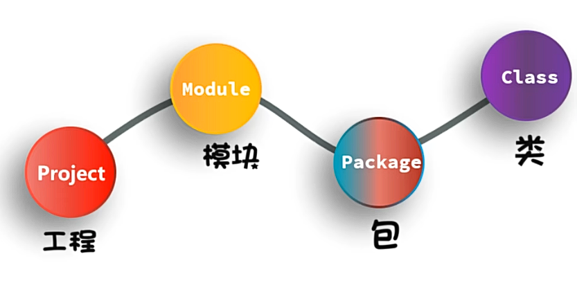
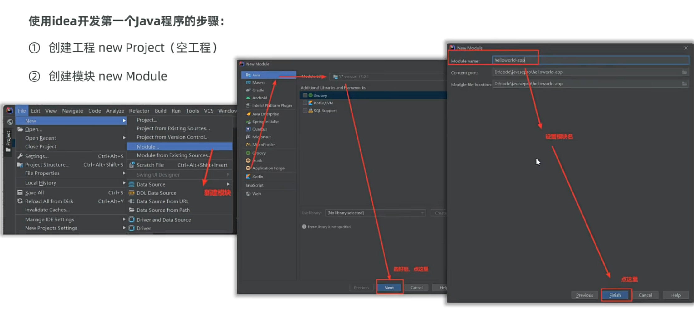
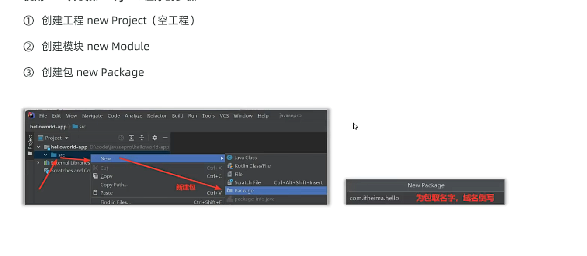
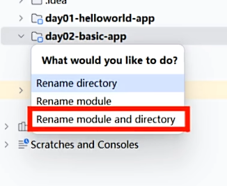
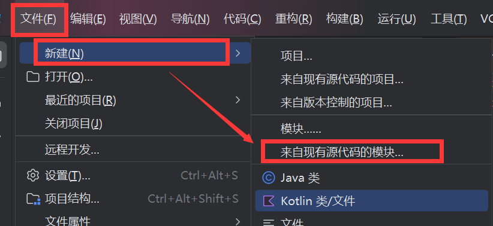

### 一、java手动编译：
**1.创建一个Java源文件：** 在命令行中，进入你想要创建源文件的目录，并使用以下命令创建一个名为HelloWorld.java的源文件：
```bash
javac HelloWorld.java
```
### 二、IDE： 
IDE（Integrated Development Environment）是集成开发环境，它是一个软件工具，集成了JDK、代码编写窗、编译、执行的开发工具，用于开发软件。
**1.idea创建Java项目的代码结构：**


```
这样划分的目的是便于管理
```
**2.idea创建java项目：**



---



* **修改模块的注意事项：**

将文件夹和模块名一起修改


* **导入模块的注意事项：**

导入模块后需要按照下图操作联立模块



