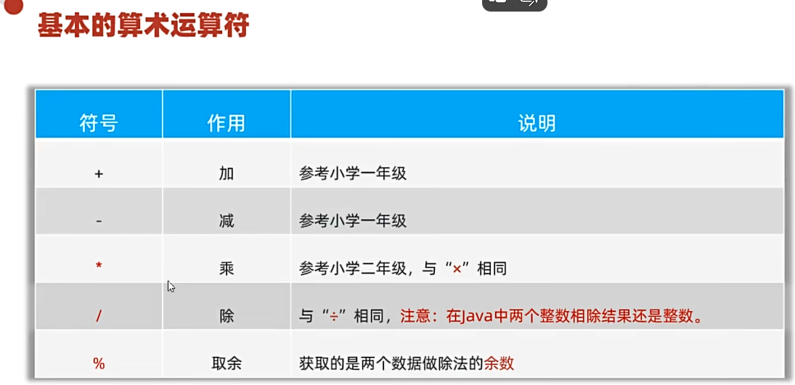
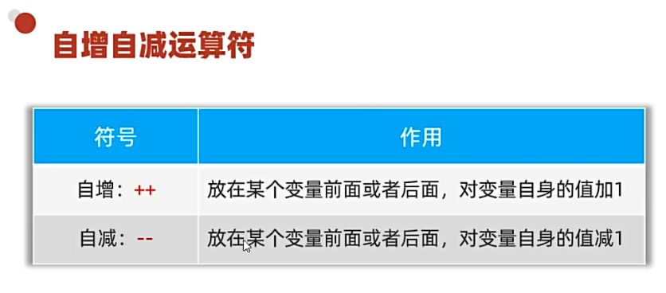
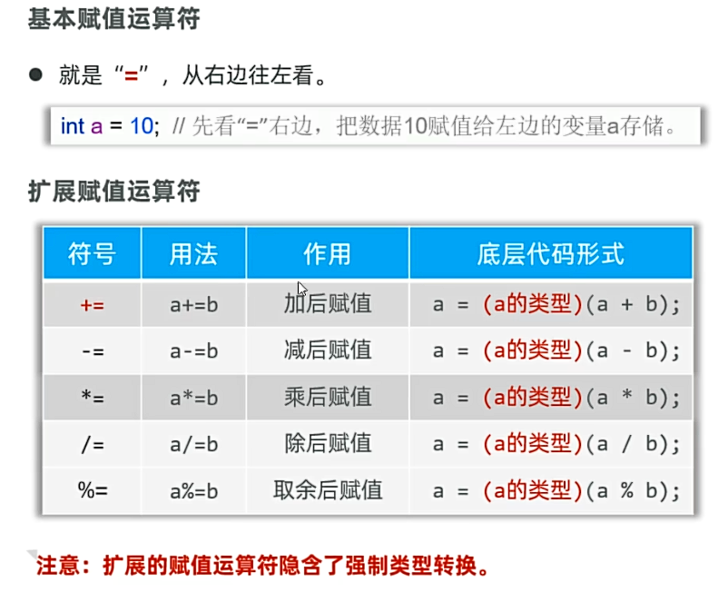
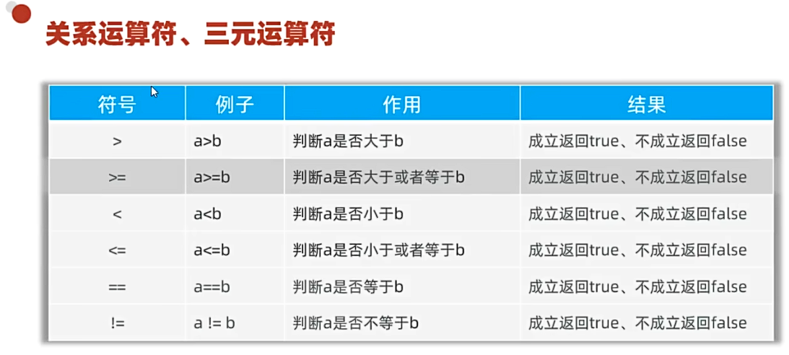
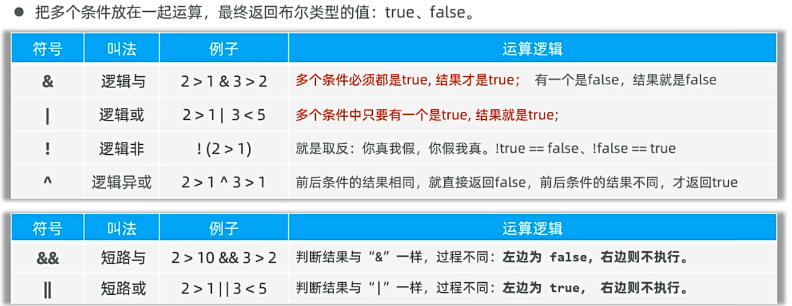

## 一、基础运算符
如下图所示：

* 其中，“+”在Java中是两种用途：
  * 加号：加号用于加法运算。
  * 拼接符：加号用于拼接字符串，在字符串中间使用“+”的运算结果依然是字符串。
  * 注意事项：当两个字符能够计算时，则计算；不能算的，“+”则用作连接符。
## 二、自增自减运算符

*  注意事项：
  * 自增自减运算符只能用于变量运算，不能操作字面量。
  * “++”、“--”如果在变量前后单独使用没有区别
  * 如果不单独使用（在表达式中或有其他操作），会有明显区别
  例如：
  ```java
  public static void print1() {
    int a = 1;
    //a++;
    //++a;
    System.out.println(a);//此时a++和++a效果一样，无论开放那一条代码，输出都为2
  }
  public static void print2() {
    int a = 1;
    int b = a++;
    int c = ++a;
    System.out.println(a);
    System.out.println(b);
    System.out.println(c);
    //此时a++和++a效果不一样，a++先赋值再加1，++a先加1再赋值,故a为3，b为1，c为3
  }
  ```
## 三、赋值运算符-三元运算符
### 1.赋值运算符

###  2.关系运算符

* 主要用于数据是否满足条件，返回判断结果，值为true或false（布尔值）
### 3.三元运算符
* 格式： 条件表达式 ? 值1 : 值2;
* 执行流程：先运算表达式的值，若值为true，则返回值1，否则返回值2

## 四.逻辑运算符

&和&&的区别，例如：
```java
public static void Test() {
    int a = 10;
    int b = 20;
    //System.out.println(a > 100 & ++b > 15);//此时布尔值为false，b会自增，为21
    //System.out.println(a > 100 && ++b > 15);//此时布尔值为true，b不会自增，为20
    //System.out.println(a > 100 | ++b > 150);//此时布尔值为false，b会自增，为21
    //System.out.println(a > 0 || ++b > 15);//此时布尔值为true，b不会自增，为20
    System.out.println(b);
}
```

