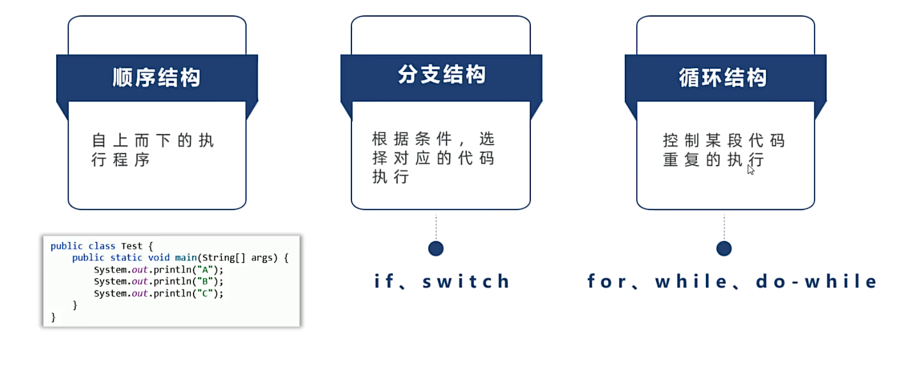
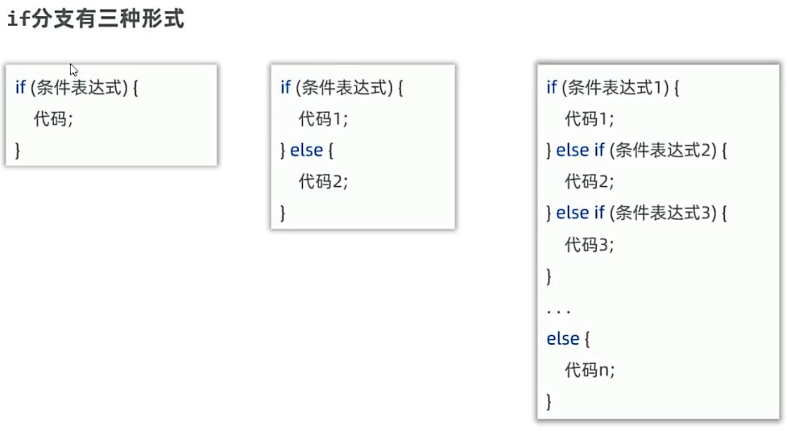
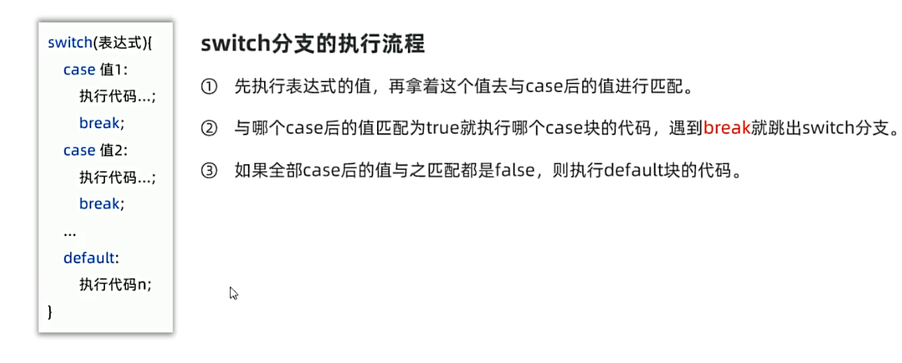

## 一、程序中的三种执行程序

## 二、分支结构
### 1.if分支
* 根据条件的真假，来决定执行某段代码。

### 2.switch分支
* 比较值是否相等，来决定执行哪段代码。

```java
public static void Test() {
  //用户输入性别
  System.out.println("请输入性别：");
  Scanner sc = new Scanner(System.in);
  String sex = sc.next();
  switch (sex) {
    case "男":
      System.out.println("你是一个男性");
      break;
    case "女":
      System.out.println("你是一个女性");
      break;
    default:
      System.out.println("你是人吗？你就摁回车？");
  }
}
```
* switch分支的注意事项：
  * 表达式类型只能是byte、short、char、int,JDK5后开始支持enum类型,JDK7开始支持String类型，不支持float、double、long类型
  * case给出的值必须是字面量，不能是变量。
  * 使用switch时，若不写break, 会出现穿透现象。
  关于穿透现象：
  ```java
  public static void Test2() {
    String week = "周二";
    switch (week) {
      case "周一":
      case "周二":
      case "周三":
      case "周四":
      case "周五":
          system.out.println("学习");
          break;
      case "周六":
      case "周日":
          system.out.println("休息");
          break;
      default:
          system.out.println("输入错误");   
    }
  }
  ```
如上述例子所示，穿透性可以允许程序将相同的case合并，减少重复代码书写

