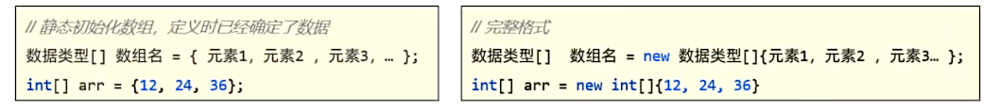
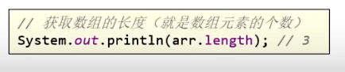
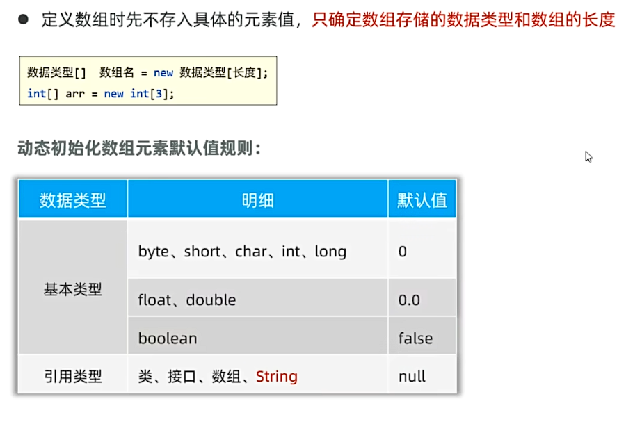
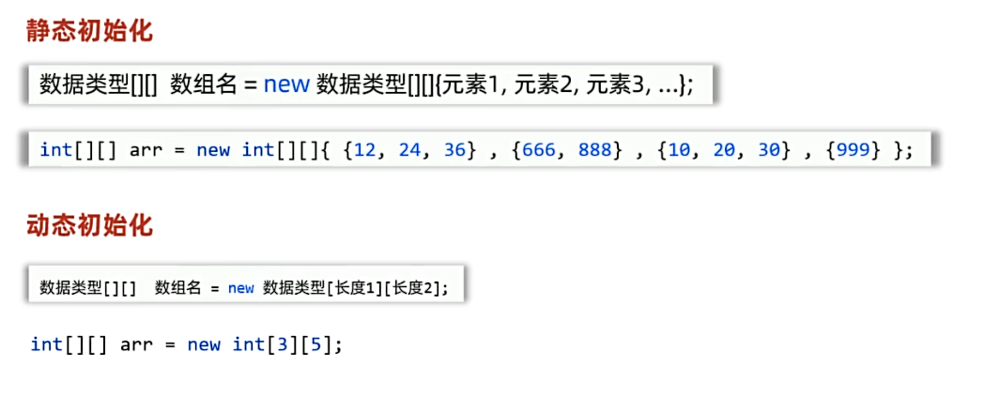
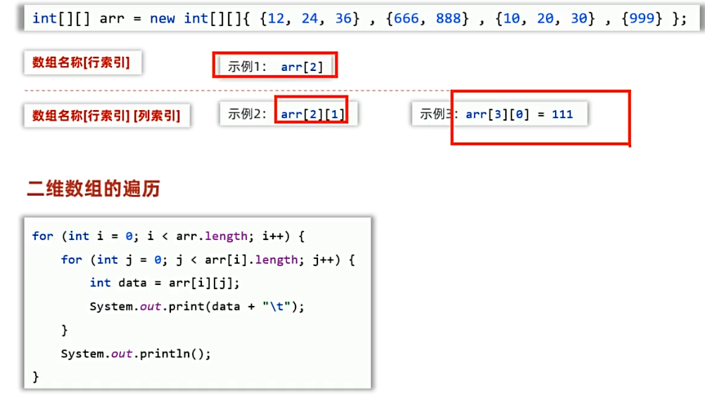

## 一、数组概述/一维数组
### 1.数组：
* 数组是一个数据容器，可用来存储同一批类型数据。

其中，“数据类型[] 数组名”也可以写成“数据类型 数组名[]”
### 2.数组的访问：

### 3.获取数组的长度：

举个例子：
```java
public static void callName() {
        //1.设计点名程序，假设一个班有十五个学生，随机生成15个学生的一维数组
        //静态初始化数组，数组元素已经明确
        String[] names = { "王伟", "李芳", "张娜", "刘强", "陈洋",
                "杨敏", "黄丽", "赵勇", "周静", "吴杰",
                "王志强", "李美丽", "张建国", "刘秀英", "陈桂英"};
        //静态初始化数组的其他写法
        //String[] names = new String[]{"王伟", "李芳", "张娜", "刘强", "陈洋",
        //        "杨敏", "黄丽", "赵勇", "周静", "吴杰",
        //        "王志强", "李美丽", "张建国", "刘秀英", "陈桂英"};

        //2.随机获取一个索引值
        //索引：在定义数组后，数组中的数据会有一个编号，从0开始排列
        //数组中的第一个元素的索引值为0，第二个元素的索引值为1，以此类推
        //索引值的范围：0~数组长度-1
        //Math.random()方法可以生成一个0~1之间的随机小数
        //Math.random() * 数组长度可以生成一个0~数组长度之间的随机数
        int index = (int) (Math.random() * names.length);
        //3.根据索引值获取对应的学生姓名
        String name = names[index];
        //4.输出结果
        System.out.println("被点到的学生姓名为：" + name);
    }
```
### 4.动态初始化数组：

* 遍历：一个一个访问数据。
例子：生成54张扑克牌，并洗牌
```java
//定义方法，存储54张扑克牌
    public static void card() {
        //1、定义一个数组，用来存储54张扑克牌
        String[] cards = new String[54];
        //2、定义一个数组，用来存储54张扑克牌的花色
        String[] colors = {"♠", "♥", "♣", "♦"};
        //3、定义一个数组，用来存储54张扑克牌的数字
        String[] numbers = {"2", "A", "K", "Q", "J", "10", "9", "8", "7", "6", "5", "4", "3"};
        //4、遍历点数
        int index = 0;//初始化索引，用来存储扑克牌的索引位置
        for (int i = 0; i < numbers.length; i++) {
            //5、遍历花色
            for (int j = 0; j < colors.length; j++) {
                //6、将花色和点数拼接成一张扑克牌
                cards[index++] = colors[j] + numbers[i];
            }
        }
        //7、将大小王存入数组
        cards[index++] = "SmallJoker";
        cards[index] = "BigJoker";
        //8、遍历数组，打印54张扑克牌
        System.out.println("新牌为：");
        for (int i = 0; i < cards.length; i++) {
            System.out.print(cards[i] + "\t");
        }
        System.out.println();
        //9、洗牌：打乱54张扑克牌
        for (int i = 0; i < cards.length; i++) {
            //随机生成一个索引，用来交换数组中的元素
            int index1 = (int)(Math.random() * cards.length);
            //随机生成另一个索引，用来交换数组中的元素
            int index2 = (int)(Math.random() * cards.length);
            //交换数组中的元素
            //交换的方法：
            //1、定义一个临时变量，用来存储数组中的元素
            String temp = cards[index1];
            //2、将index2中的元素赋值给index1
            cards[index1] = cards[index2];
            //3、将temp中的元素赋值给index2，完成交换
            cards[index2] = temp;
        }
        //打印洗牌后的54张扑克牌
        System.out.println("洗牌后的牌为：");
        for (int i = 0; i < cards.length; i++) {
            System.out.print(cards[i] + "\t");
        }
    }
```
## 二、二维数组
* 数组中的每个元素都是一个一维数组，这个数组就是二维数组。
### 1.二维数组的初始化

### 2.二维数组的访问：

例子：
```java
private static void twoArray(){
        //初始化二维数组存储学生姓名。因为座位不规则，手动定义
        String[][] classroom = new String[][]{
                {"张三","李四","王五","赵六"},
                {"田七","宋八","周九","吴十"},
                {"郑十一","蒋十三","韩十四"},
                {"刘十五","陈十六","杨十七","张十八"},
                {"吴十九","郑二十","冯二十一","蒋二十二","杨二十六"},
                {"韩二十三","刘二十四","陈二十五"},
                {"张二十七","吴二十八","郑二十九","冯三十"}
        };
        //访问二维数组: 数组名[行索引]
        String[] names = classroom[0];
        //遍历二维数组中的一维数组
        for (int i = 0; i < names.length; i++) {
            //遍历二维数组中的一维数组中的元素
            System.out.println(names[i]);
        }
        System.out.println("-------------------");
        //第二种访问：数组名[行索引][列索引]
        System.out.println(classroom[1][1]);

        System.out.println("-------------------");
        //长度访问：数组名.length
        System.out.println(classroom.length);
        System.out.println(classroom[3].length);

        System.out.println("------------------------");
        //遍历整个二维数组
        for (int i = 0; i < classroom.length; i++){
            String[] names1 = classroom[i];
            for (int j = 0; j < names1.length; j++) {
                System.out.print(names1[j] + "\t");
            }
            System.out.println();
        }
        System.out.println("------------------------");
        //另一种遍历方法
        for (int i = 0; i < classroom.length; i++){
            for (int j = 0; j < classroom[i].length; j++) {
                System.out.print(classroom[i][j] + "\t");
            }
            System.out.println();
        }
    }
```
* 二维数组的应用，数字华容道：
```java
public static void start(int n){
        //定义二维数组存储数字
        int[][] array = new int[n][n];
        //遍历二维数组，给二维数组赋值
        int count = 1;
        for (int i = 0; i < array.length; i++){
            for (int j = 0; j < array[i].length; j++){
                array[i][j] = count++;
            }
        }
        printArray(array);//打印二维数组
        //打乱二维数组的数字
        for (int i = 0; i < array.length; i++){
            for (int j = 0; j < array[i].length; j++){
                //遍历到array[i][j]
                //随机的索引位置：index1（行）和index2（列）
                int index1 = (int) (Math.random() * array.length);
                int index2 = (int)(Math.random() * array.length);

                //定义临时的变量存储index1,index2处的元素
                int temp = array[index1][index2];
                //将i,j的元素赋给index1,index2
                array[index1][index2] = array[i][j];
                //将存放index1,index2处元素的临时变量赋给i,j
                array[i][j] = temp;
            }
        }
        System.out.println("洗牌后的牌为：");
        printArray(array);
    }
    public static void printArray(int[][] array){
        for (int i = 0; i < array.length; i++){
            for (int j = 0; j < array[i].length; j++){
                System.out.print(array[i][j] + "\t");
            }
            System.out.println();
        }
    }
```
