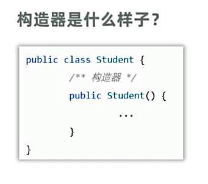
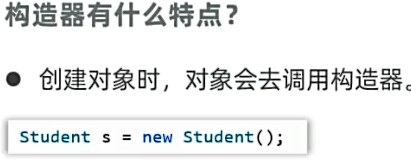
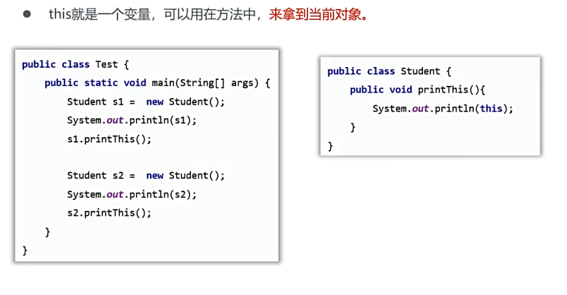
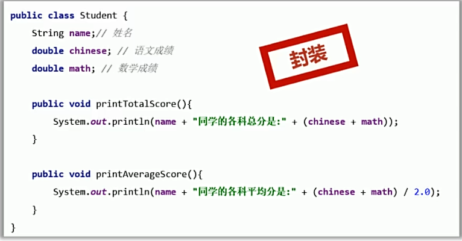
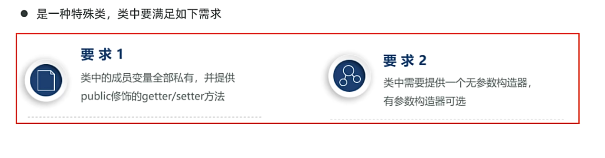
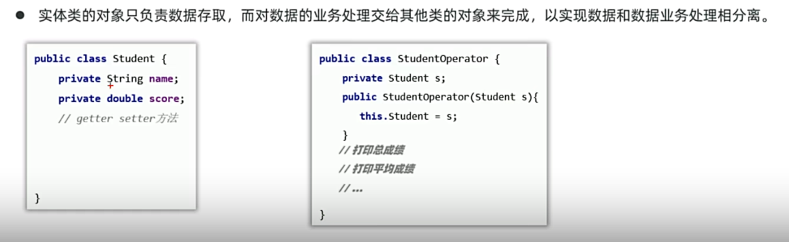
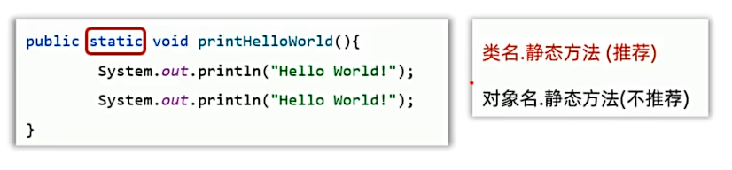
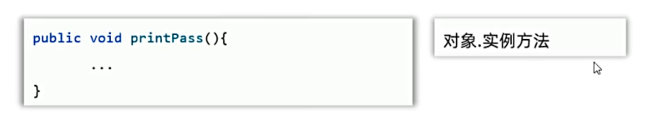
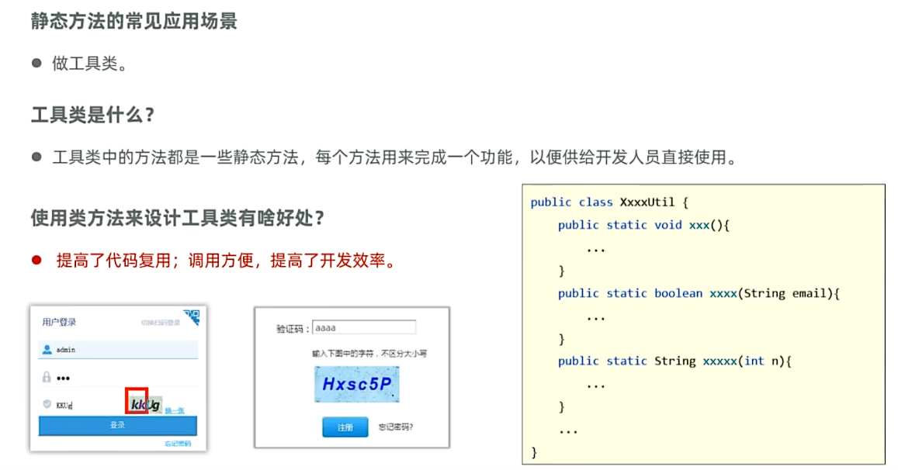

## 一、对象
* 对象是一种特殊的数据结构，可以记住一个事物的数据，代表该事务。
### 1.面向对象编程的步骤
**(1)先设计对象的模板，即对象的设计图，又叫类。**
例如：
```java
public class Person{
  String name;
  int age;
  double height;
  double weight;
}
```
**(2)通过new关键字，每new一次类，即可得到一个新的对象。**
```java
public static void main(String[] args){
  Person p1 = new Person();
  p1.name = "张三";
  p1.age = 18;
  p1.height = 180.0;
  p1.weight = 80.0;

  Person p2 = new Person();
  p2.name = "李四";
  p2.age = 20;
  p2.height = 170.0;
  p2.weight = 70.0;
}
```
**(3)封装思想:将数据和对数据的处理放在同一个类中**
```java
public class Student {
    String name;
    double chinese;
    double math;
    //处理总成绩
    //封装思想：将数据和对数据的处理放在同一个类中
    public void printScore() {
        System.out.println(name + "的语文成绩为：" + chinese
                                + "\n数学成绩为：" + math
                                + "\n总成绩为：" + (chinese + math)
                                + "\n平均成绩为：" + (chinese + math) / 2);
    }
}
```
**(4)操作对象数据**
```java
public static void main(String[] args) {
        //获取学生数据，操作学生数据
        Student student1 = new Student();
        student1.name = "张三";
        student1.chinese = 90;
        student1.math = 80;
        student1.printScore();
    }
```
* 面向对象编程的本质：万物皆对象，谁的数据谁存储

## 二、构造器

### 1.构造器类型
```java
public class Student {
    //1.无参构造器
    //构造器：特殊的方法，不写返回值，方法名必须与类名相同
    public Student() {

    }
    //2.有参构造器
    public Student(String name, int age) {
    }
    public Student(String name, int age, int score) {
    }
}
```
### 2.构造器特点

### 3.构造器常见应用场景
* 创建对象时，同时完成对象成员变量（属性）的初始赋值。
### 4.构造器注意事项
* 类默认自带无参构造器
* 如果定义了有参构造器，则类将不再默认自带无参构造器，需手写一个构造器。
例如：
```java
/*
*Test.java
*/
public static void main(String[] args) {
        // 认识构造器及其常见应用场景
        //创建对象时，会自动调用构造器，具体调用什么构造器根据括号里面的参数来决定
        Student s1 = new Student();
        Student s2 = new Student("张三", 18);

        // 构造器的应用场景：创建对象时，可以立即为对象的成员变量赋值
        Student s3 = new Student("张三", 18, 100);
        System.out.println(s3.name);
        System.out.println(s3.age);
        System.out.println(s3.score);
    }
```
```java
/*
 * Student.java
 */
public class Student {
    String name;
    int age;
    int score;
    //1.无参构造器
    //构造器：特殊的方法，不写返回值，方法名必须与类名相同
    public Student() {
        System.out.println("-----无参构造器执行了----");

    }
    //2.有参构造器
    public Student(String name, int age) {
        System.out.println("-----有参构造器执行了----");
    }
    public Student(String n, int a, int s) {
        name = n;
        age = a;
        score = s;
    }
```
## 三、this关键字

例子：
```java
/*
* Student.java
*/
public class Student {
    String name;
    public void print() {
        //this是一个变量，表示当前对象
        //哪个对象调用方法，this就代表哪个对象
        System.out.println(this);
        System.out.println(this.name);
    }
}
```
```java
/*
* Test.java
*/
 public static void main(String[] args) {
        Student student = new Student();
        student.name = "李宝辉";
        student.print();
        System.out.println(student);

        System.out.println("=============");

        Student student1 = new Student();
        student1.print();
        System.out.println(student1);

    }
```
**（1）this关键字的应用场景**
* this主要用来解决变量名称冲突的问题。
```java
/*
* Student.java
*/
public class Student {
    String name;
    public void print1(String name){
        //若对象的成员变量和形参变量重名，会因为就近原则导致冲突，使用this.name表示成员变量可解决问题
        System.out.println(name + "喜欢" + name);
        System.out.println(this.name + "喜欢" + name);
    }
}
```
```java
/*
* Test.java
*/
public static void main(String[] args) {
    Student student2 = new Student();
    student2.name = "张三";
    student2.print1("李四");
}
```
## 四、封装
* 面向对象的三大特性：封装、继承、多态。
* 封装：将数据和对数据的处理放在同一个类中。
  * 类就是一种封装。

* 封装的设计要求
  * 八字：合理隐藏，合理暴露。
  * 即使在开发过程中对象内部没有校验，校验在前端进行，也应当使用封装，是Java的规范！！！
```java
/*
* Student.java
*/
public class Student {
    //封装的要求：合理隐藏，合理暴露
    //1.隐藏的方法：使用private（私有）修饰成员变量，禁止外部访问，只能在本类中访问
    private String name;
    private int age;
    private double chinese;
    private double math;

    //2.暴露的方法(合理暴露)：使用public（公共）修饰的getter/setter方法暴露
    public void setName(String name) {//为名字设置值
        this.name = name;
    }
    public String getName() {//获取名字
        return name;
    }
    public void setAge(int age) {
        //为年龄设置值
        if (age < 0 || age > 120) {
            System.out.println("年龄不合法");
        }else{
            this.age = age;
        }
    }
    public int getAge() {
        return age;
    }
}
```
```java
/*
* Test.java
*/
public static void main(String[] args) {
        Student student = new Student();
        student.setName("张三");
        student.setAge(18);
        System.out.println(student.getName());
        System.out.println(student.getAge());
    }
```
## 五、实体类

```java
/*
* Student.java
*/
public class Student {
    //实体类要求：
    //1.属性私有化
    private String name;
    private int age;
    private int chinese;
    private int math;

    //4.但如果要提供了有参构造器，那么一定要提供无参构造器
    public Student() {
    }

    //3.提供有参构造器（可选）
    public Student(String name, int age, int chinese, int math) {
        this.name = name;
        this.age = age;
        this.chinese = chinese;
        this.math = math;
    }


    //2.提供getter和setter方法

    public String getName() {
        return name;
    }

    public void setName(String name) {
        this.name = name;
    }

    public int getAge() {
        return age;
    }

    public void setAge(int age) {
        this.age = age;
    }

    public int getChinese() {
        return chinese;
    }

    public void setChinese(int chinese) {
        this.chinese = chinese;
    }

    public int getMath() {
        return math;
    }

    public void setMath(int math) {
        this.math = math;
    }
}
```
```java
/*
* Test.java
*/
 public static void main(String[] args) {
        //实体类的作用：创建它的对象，存取数据（封装数据）
        //使用无参数构造方法创建对象
        Student student = new Student();
        student.setName("张三");
        student.setAge(18);
        student.setChinese(100);
        student.setMath(100);
        System.out.println(student.getName() + "的语文成绩为：" + student.getChinese()
                + "\n数学成绩为：" + student.getMath()
                + "\n总成绩为：" + (student.getChinese() + student.getMath())
                + "\n平均成绩为：" + (student.getChinese() + student.getMath()) / 2);
        System.out.println("=======================================================");
        //使用有参数构造方法创建对象
        Student student1 = new Student("李四", 18, 100, 100);
        System.out.println(student1.getName() + "的语文成绩为：" + student1.getChinese()
                + "\n数学成绩为：" + student1.getMath()
                + "\n总成绩为：" + (student1.getChinese() + student1.getMath())
                + "\n平均成绩为：" + (student1.getChinese() + student1.getMath()) / 2);
    }
```
* 实体类的应用场景：

例子：
```java
/*
* Student.java
*/
public class Student {
    //实体类要求：
    //1.属性私有化
    private String name;
    private int age;
    private int chinese;
    private int math;

    //4.但如果要提供了有参构造器，那么一定要提供无参构造器
    public Student() {
    }

    //3.提供有参构造器（可选）
    public Student(String name, int age, int chinese, int math) {
        this.name = name;
        this.age = age;
        this.chinese = chinese;
        this.math = math;
    }


    //2.提供getter和setter方法

    public String getName() {
        return name;
    }

    public void setName(String name) {
        this.name = name;
    }

    public int getAge() {
        return age;
    }

    public void setAge(int age) {
        this.age = age;
    }

    public int getChinese() {
        return chinese;
    }

    public void setChinese(int chinese) {
        this.chinese = chinese;
    }

    public int getMath() {
        return math;
    }

    public void setMath(int math) {
        this.math = math;
    }
}
```
```java
/*
* Test.java
*/
public static void main(String[] args) {
        //实体类的作用：创建它的对象，存取数据（封装数据）
        //使用无参数构造方法创建对象
        Student student = new Student();
        student.setName("张三");
        student.setAge(18);
        student.setChinese(100);
        student.setMath(100);

        //使用有参数构造方法创建对象
        Student student1 = new Student("李四", 18, 80, 80);

        //实体类在开发中的应用场景
        //创建学生的操作对象，专门负责对学生对象进行业务处理
        StudentService studentService = new StudentService(student);//更换括号里的对象，可以实现对任意对象的业务处理
        studentService.printTotalScore();
        studentService.printAverageScore();

    }
```
```java
/*
* StudentService.java
*/
public class StudentService {
    //service用来处理业务逻辑
    //拿到需要处理的学生对象
    private Student student;
    public StudentService(Student student) {
        this.student = student;
    }
    public void printTotalScore() {
        System.out.println(student.getName() + "的总成绩为：" + (student.getChinese() + student.getMath()));
    }

    public void printAverageScore() {
        System.out.println(student.getName() + "的平均成绩为：" + (student.getChinese() + student.getMath()) / 2);
    }
}
```
## 六、static 关键字
* static，静态，可以修饰成员变量，成员方法。
### 1.static修饰成员变量
**成员变量按照有无static修饰，分为静态成员变量和实例成员变量：**
* 静态成员变量：静态成员变量，也叫类变量，有static修饰，在计算机中只有一份，被类的全部对象所共享。
* 实例变量：实例成员变量，也叫对象的变量，没有static修饰，属于每一个对象。
例子：
```java
/*
* Student.java
*/
public class Student {
    // 静态变量：由static修饰，属于类，只加载一份，所有对象共享
    static String name;
    //  实例变量：无static修饰，属于对象，每个对象有自己一份
    int age;
}
```
```java
/*
* Test.java
*/
 public static void main(String[] args) {
        //认识static修饰符
        //1.类名.静态变量（推荐）
        Student.name = "张三";
        System.out.println(Student.name);

        //2.对象.静态变量（不推荐）
        Student student = new Student();
        student.name = "李四";

        System.out.println(student.name);

        Student student1 = new Student();
        student1.name = "王五";

        System.out.println(student.name);//王五
        System.out.println(student1.name);//二者输出均为王五，因为静态变量name是类变量，只以最后一个改动的名称为准

        //3.对象名.实例变量
        student.age  = 18;
        student1.age = 12;
        System.out.println(student.age);
        System.out.println(student1.age);//二者输出不同，因为age是实例变量，以对象调用为准
    }
```
* 静态变量的应用场景
  *如果某数据只要一份，且需要被共享、访问、修改，则该数据应当被定义为静态变量来记住。
例子：记录用户数量：
```java
/*
*User.java
*/
public class User {

    public static int count = 0;
    public User(){
        //User.count++;
        //二者等价，同一个类中访问静态变量，可省略类名
        count++;
    }
}
```
```java
/*
* Test.java
*/
 public static void main(String[] args) {
        //  静态方法
        new User();
        new User();
        new User();
        System.out.println(User.count);
    }
```
### 2.static修饰成员方法
* 静态方法：静态方法，也叫类方法，有static修饰，属于类。
  
* 实例方法：实例方法，没有static修饰，属于对象，需要创建对象，通过对象调用。 
 
* 规范：如果该方法只是为了做一个功能，而不需要直接访问对象的数据，那么该方法应该定义为静态方法。若这个方法是对象的行为，需要访问对象数据，那么该方法应该定义为实例方法。
**(1)静态方法应用场景：**

* 为什么工具类不用实例方法：实例方法需要创建对象调用，此时对象只是为了调用方法，对象占用内存，会浪费内存，静态方法直接用类名调用，调用方便，节省内存。
* 妙招：工具类没有创建对象的需求，所以可以将工具类的构造器私有化
**(2)静态方法注意事项**
* 1.静态方法可直接访问静态成员，不能直接访问实例成员；
* 2.实例方法既可以访问静态成员，也可以访问实例成员；
* 3.静态方法不能使用this关键字，实例方法可以使用this关键字；
```java
public class Test2 {
    //静态变量
    public static int count = 0;
    //静态方法
    public static void printHelloWorld2() {
        System.out.println("HelloWorld");
    }
    
    //实例变量，属于对象持有
    private String name;
    //实例方法
    public void printName(){

    }
    
//        1.静态方法可直接访问静态成员，不能直接访问实例成员；
    public static void printHelloWorld(){
        System.out.println(count);
        printHelloWorld2();
        //System.out.println(name);报错，静态方法不能直接访问实例成员
        //printName();报错，静态方法不能直接访问实例成员
    }
    
//        2.实例方法既可以访问静态成员，也可以访问实例成员；
    public void printHelloWorld3(){
        System.out.println(count);
        printHelloWorld2();
        System.out.println(name);
        printName();
    }
    
//        3.静态方法不能使用this关键字，实例方法可以使用this关键字；
    public static void printHelloWorld4(){
        //System.out.println(this.count);//报错
    }
    public void printHelloWorld5(){
        System.out.println(this.count);
    }
}
```
## 综合案例：丐版电影信息管理
```java
/*
* Movie.java
*/
public class Movie {
    private int id;
    private String name;
    private double price;
    private String actor;

    public Movie() {
    }

    public Movie(int id, String name, double price, String actor) {
        this.id = id;
        this.name = name;
        this.price = price;
        this.actor = actor;
    }

    public int getId() {
        return id;
    }

    public void setId(int id) {
        this.id = id;
    }

    public String getName() {
        return name;
    }

    public void setName(String name) {
        this.name = name;
    }

    public double getPrice() {
        return price;
    }

    public void setPrice(double price) {
        this.price = price;
    }

    public String getActor() {
        return actor;
    }

    public void setActor(String actor) {
        this.actor = actor;
    }
}
```
```java
/*
* Test.java
*/
public static void main(String[] args) {
        // 需求：完成一个面向对象案例
        //展示电影信息，根据id查电影
        Movie[] movies = new Movie[6];
        //此时，movies = [null, null, null, null, null, null]
        movies[0] = new Movie(1, "唐顿庄园", 9.5, "罗宾·怀特");
        movies[1] = new Movie(2, "唐顿庄园2", 9.5, "罗宾·怀特");
        movies[2] = new Movie(3, "唐顿庄园3", 9.5, "罗宾·怀特");
        movies[3] = new Movie(4, "唐顿庄园4", 9.5, "罗宾·怀特");
        movies[4] = new Movie(5, "唐顿庄园5", 9.5, "罗宾·怀特");
        movies[5] = new Movie(6, "唐顿庄园6", 9.5, "罗宾·怀特");

        //3. 创建电影操作对象，用于电影业务操作
        MovieService movieService = new MovieService(movies);
        movieService.showMovie();
        movieService.findMovieById();
    }
```
```java
/*
* MovieService.java
*/
public class MovieService {
    // 业务逻辑层
    // 将电影数据传进来
    private Movie[] movies;
    public MovieService(Movie[] movies) {
        this.movies = movies;
    }

    //展示所有的电影
    public void showMovie() {
        for (int i = 0; i < movies.length; i++) {
            Movie movie = movies[i];
            System.out.println(movie.getName() + "  " + movie.getPrice() + "  " + movie.getActor());
        }

    }

    public void findMovieById() {
        System.out.println("请输入要查找的电影编号：");
        Scanner  sc = new Scanner(System.in);
        int id = sc.nextInt();
        for (int i = 0; i < movies.length; i++) {
            Movie movie = movies[i];
            if (movie.getId() == id) {
                System.out.println(movie.getName() + "  " + movie.getPrice() + "  " + movie.getActor());
                return;
            }
        }
        System.out.println("没有找到该电影");
    }
}
```