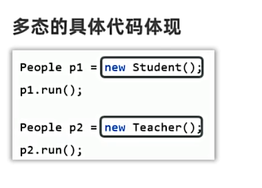
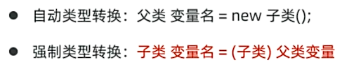
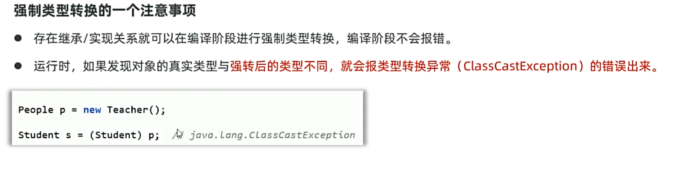
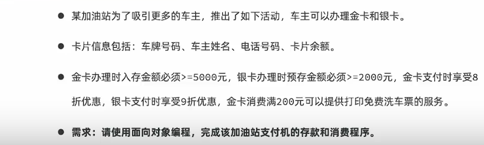

## 一、认识多态
* 多态：在继承/实现的情况下的一种现象，表现为：对象多态，行为多态。
 
* 多态的前提：
  * 有继承/实现的关系；存在父类引用子类对象，存在方法重写。
  * 多态是对象、行为的多态，Java中的属性（成员变量）没有多态。
例子：
```java
/*
*Animal.java
*/
public class Animal {
    String name = "动物";
    public void eat(){
        System.out.println("Animal is eating");
    }
}
```
```java
/*
*Wolf.java
*/
public class Wolf extends Animal {
    String name = "狼";

    @Override
    public void eat(){
        System.out.println("狼吃肉");
    }
}
```
```java
/*
*Dog.java
*/
public class Dog extends Animal {
    String name = "旺财";
    @Override
    public void eat()
    {
        System.out.println("狗吃shit");
    }
}
```
```java
/*
*Test.java
*/
  public static void main(String[] args) {
        //认识多态
        //1、对象多态,行为多态
        Animal animal = new Dog();
        animal.eat();//对于方法：编译看左，运行看右
        System.out.println(animal.name);//对于成员变量：编译看左，运行看左
        Animal animal1 = new Wolf();
        animal1.eat();//对于方法：编译看左，运行看右
        System.out.println(animal1.name);//对于成员变量：编译看左，运行看左

    }
```
## 二、多态的好处
* 在多态的形式下，右边对象解耦合，便于扩展和维护。
* 定义方法时，使用父类类型的形参，可以接收所有的子类对象，扩展性强，更便利。
**多态产生的问题：** 多态下不能调用子类特有方法
**多态的类型转换（用于解决上述问题）**


* 在强行转换类型前，使用instanceof判断当前对象的真实类型，再进行强转。
例子：
```java
public static void main(String[] args) {
        //认识多态的作用
        //1、多态好处1：右边的对象时解耦合的
        Animal animal = new Dog();
        animal.eat();
        System.out.println("----------------");

        //animal.doThings();//报错，多态下不能调用子类特有方法
        //强制类型转换
        Dog dog2 = (Dog)animal;
        dog2.tail();
        System.out.println("----------------");

        //只需更换右边对象即可，无需继续修改下面的父类方法
        Animal animal1 = new Wolf();
        animal1.eat();

        //多态好处2：父类类型的变量做参数，可以接收一个子类对象
        Wolf wolf = new Wolf();
        eat(wolf);

        Dog dog = new Dog();
        eat(dog);
        System.out.println("----------------");
        //类型转换异常：有继承关系就能强制转换，编译阶段不报错
        //运行时出现类型转换异常：ClassCastException
        //Wolf wolf1 = (Wolf)animal;
        //强行转换前，使用instanceof判断当前对象的真实类型，再进行强转。
        if(animal instanceof Wolf){
            Wolf wolf1 = (Wolf)animal;
            wolf1.cry();
        }else if(animal instanceof Dog){
            Dog dog1 = (Dog)animal;
            dog1.tail();
        }
    }
    public static void eat(Animal animal){
        System.out.println("---------");
        animal.eat();
    }
```
实体类同“多态例子”
## 三、继承、多态案例
**加油站卡片支付案例**

例子：
```java
//Card.java
public class Card {
    private String cardId;
    private String name;
    private String phone;
    private double money;

    //存金额的方法
    public void saveMoney(double money){
        this.money += money;
    }
    //取金额的方法
    public void spendMoney(double money) {
        this.money -= money;
    }


    public Card() {
    }

    public Card(String cardId, String name, String phone, double money) {
        this.cardId = cardId;
        this.name = name;
        this.phone = phone;
        this.money = money;
    }

    public String getCardId() {
        return cardId;
    }

    public void setCardId(String cardId) {
        this.cardId = cardId;
    }

    public String getName() {
        return name;
    }

    public void setName(String name) {
        this.name = name;
    }

    public String getPhone() {
        return phone;
    }

    public void setPhone(String phone) {
        this.phone = phone;
    }

    public double getMoney() {
        return money;
    }

    public void setMoney(double money) {
        this.money = money;
    }

    @Override
    public String toString() {
        return "Card{" +
                "cardId='" + cardId + '\'' +
                ", name='" + name + '\'' +
                ", phone='" + phone + '\'' +
                ", money=" + money +
                '}';
    }

}
```
```java
//GoldCard.java
public class GoldCard extends Card {
    public GoldCard(String cardId, String name, String phone, double money) {
        super(cardId, name, phone, money);
    }

    //金卡优惠项目：打八折，消费过200，打印洗车票
    @Override
    public void spendMoney(double money) {
        if(this.getMoney() >= money) {
            System.out.println("当前金卡消费：" + money);
            System.out.println("优惠后的消费" + money * 0.8);
            this.setMoney(this.getMoney() - money * 0.8);
            System.out.println("当前余额：" + this.getMoney());
            if (money * 0.8 >= 200){
                washCar();
            }else {
                System.out.println("消费不足200，没有洗车服务");
            }
        }else{
            System.out.println("余额不足");
        }
    }
    //打印洗车票
    public void washCar() {
        System.out.println("洗车票");
    }
}
```
```java
//SilverCard.java
public class SilverCard extends Card {
    public SilverCard(String cardId, String name, String phone, double money) {
        super(cardId, name, phone, money);
    }

    //银卡优惠项目：打九折
    public void spendMoney(double money) {
        if(this.getMoney() >= money) {
            System.out.println("当前银卡消费：" + money);
            System.out.println("优惠后的消费" + money * 0.9);
            this.setMoney(this.getMoney() - money * 0.9);
            System.out.println("当前余额：" + this.getMoney());
        }else{
            System.out.println("余额不足");
        }
    }
}
```
```java
//Test.java
public class Test {
    //加油站卡片支付小程序
    //1.创建卡片类，以便继续创建金卡，银卡对象，封装车主数据
    //2.创建父类Card，定义金卡银卡的属性方法
    //3.创建子类GoldCard，继承父类Card，定义特权方法,金卡重写消费方法，八折优惠，打印洗车票
    //4.创建子类SilverCard，继承父类Card，定义特权方法,银卡重写消费方法，九折优惠

    public static void main(String[] args) {
        //5.创建金卡(余额5000以上)、银卡对象（余额2000以上），处理金卡、银卡的业务逻辑
        GoldCard goldCard = new GoldCard("皖A21231", "李宝华", "13812345678", 10000);
        pay(goldCard);
        SilverCard silverCard = new SilverCard("皖A21232", "李宝华", "13812345678", 3000);
        pay(silverCard);

    }
    //创建方法，处理支付业务逻辑
    public static void pay(Card card) {
        //输入金额
        System.out.println("请输入金额：");
        Scanner scanner = new Scanner(System.in);
        double money = scanner.nextDouble();
        card.spendMoney(money);
    }
}
```