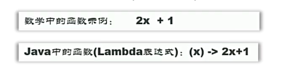
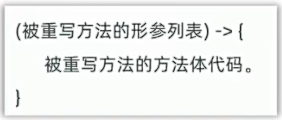

## 一、函数式编程
* 此“函数”类似于数学中的函数（强调做什么），只要输入的数据一致返回的结果也一样
  
**函数式编程解决了什么问题？**
* 使用Lambda函数替代某些匿名内部类的对象，可以让程序代码更简洁，可读性强 

* **注意：Lambda表达式，只能代替函数式接口的匿名内部类！！！**
  * **将来我们见到的大部分函数式接口，上面都可能会有一个@FunctionalInterface注解, 该注解用于约束当前接口必须式函数式接口。** 
* 什么是函数式接口？
  * 有且只有一个抽象方法的接口。
例子：
```java
public class LambdaDemo1 {
    public static void main(String[] args) {
        //目标: 认识Lambda表达式: 搞清楚其基本作用
        //Lambda不能简化全部的匿名内部类，只能简化函数式接口的匿名内部类
        //因此，以下内部类不能使用Lambda函数式来简化
        Animal animal = new Animal() {
            @Override
            public void eat() {
                System.out.println("猫吃鱼");
            }
        };
        animal.eat();
        System.out.println("========================");
//        Swim s = new Swim() {
//            @Override
//            public void swimming() {
//                System.out.println("狗刨");
//            }
//        };
        //上述函数即可用Lambda函数式简化：
        Swim s = () -> {System.out.println("狗刨");};
        s.swimming();
    }
}
abstract class Animal{
    public abstract void eat();
}
//函数式接口: 只有一个抽象方法的接口
@FunctionalInterface //用于声明函数式接口的注释
interface Swim{
    void swimming();
}
```
* **Lambda表达式的省略：**
* 作用：进一步减化Lambda表达式的写法。
* 具体规则：
  * 参数类型全部省略不写。
  * 若只有一个参数，则参数类型省略的同时"()"也可以省略；若多个参数则无法省略。
  * 若Lambda表达式中只有一行代码，大括号可不写，同时省略分号";"，如果是return语句，则"return"也省略。
Lambda表达式的省略,例子：
```java
public class LambdaDemo2 {
        // Lambda表达式简化实际的实例
    public static void main(String[] args) {
        test1();
        System.out.println("========================");
        test2();
    }
    public static void test1(){
        // 完成数组的排序，理解匿名内部类的用法。
        // 准备一个学生类型数组，存放6个学生对象
        Student[] students = new Student[6];
        students[0] = new Student("张三", 20, 1.75, "男");
        students[1] = new Student("李四", 19, 1.68, "女");
        students[2] = new Student("王五", 18, 1.69, "男");
        students[3] = new Student("赵六", 17, 1.70, "女");
        students[4] = new Student("孙七", 16, 1.71, "男");
        students[5] = new Student("周八", 15, 1.72, "女");

//        Arrays.sort(students, new Comparator<Student>() {
//            @Override
//            public int compare(Student o1, Student o2) {
//                return o1.getAge() - o2.getAge();//按照年龄升序
//            }
//        });

        //上述将年龄升序排序的例子中，即可使用Lambda表达式简化
//        Arrays.sort(students, (Student o1, Student o2) -> {
//            return o1.getAge() - o2.getAge(); //按照年龄升序
//        });

//        参数类型全部省略不写。
//        Arrays.sort(students, ( o1,  o2) -> {
//            return o1.getAge() - o2.getAge(); //按照年龄升序
//        });

//        若Lambda表达式中只有一行代码，大括号可不写，同时省略分号";"，如果是return语句，则"return"也省略。
        Arrays.sort(students, ( o1,  o2) -> o1.getAge() - o2.getAge() );
        //遍历学生对象输出
        for (int i = 0; i < students.length; i++) {
            Student student = students[i];
            System.out.println(student);
        }
    }
    public static void test2(){
        // 内部类的使用场景
        // 需求：创建一个登录窗口，窗口上写一个登录按钮
        JFrame win = new JFrame("登录窗口");
        win.setSize(300, 300);
        win.setLocationRelativeTo(null);
        win.setDefaultCloseOperation(JFrame.EXIT_ON_CLOSE);
        JPanel panel = new JPanel();
        win.add(panel);
        JButton btn = new JButton("登录");
        panel.add(btn);
//        btn.addActionListener(new ActionListener() {
//            @Override
//            public void actionPerformed(ActionEvent e) {
//                System.out.println("用户点击了登录按钮");
//            }
//        });
        //由上述年龄排序例子即可类推，该按钮点击事件也可使用Lambda表达式简化
        //btn.addActionListener((ActionEvent e) -> {  System.out.println("用户点击了登录按钮"); });

        //若只有一个参数，则参数类型省略的同时"()"也可以省略；若多个参数则无法省略。
//        btn.addActionListener( e -> {  System.out.println("用户点击了登录按钮"); });

        // 若Lambda表达式中只有一行代码，大括号可不写，同时省略分号";"，如果是return语句，则"return"也省略。

        btn.addActionListener( e ->   System.out.println("用户点击了登录按钮") );
        win.setVisible(true);
    }
}
```
## 二、方法引用
### 1. 静态方法引用
* 类名::静态方法
**使用场景**
* 若某个Lambda表达式里只调用一个静态方法，且"->"前后参数一致，即可使用静态方法引用。
静态方法引用的例子：
```java
//Student类
public class Student {
    // 学生姓名 年龄 身高 性别
    private String name;
    private int age;
    private double height;
    private String sex;

    public static int compareByAge(Student o1,Student o2){
        return o1.getAge() - o2.getAge();
    }

    public Student() {
    }

    public Student(String name, int age, double height, String sex) {
        this.name = name;
        this.age = age;
        this.height = height;
        this.sex = sex;
    }

    public String getName() {
        return name;
    }

    public void setName(String name) {
        this.name = name;
    }

    public int getAge() {
        return age;
    }

    public void setAge(int age) {
        this.age = age;
    }

    public double getHeight() {
        return height;
    }

    public void setHeight(double height) {
        this.height = height;
    }

    public String getSex() {
        return sex;
    }

    public void setSex(String sex) {
        this.sex = sex;
    }

    @Override
    public String toString() {
        return "Student{" +
                "name='" + name + '\'' +
                ", age=" + age +
                ", height=" + height +
                ", sex='" + sex + '\'' +
                '}';
    }
}
```
```java
public class Test {
    public static void main(String[] args) {
        test1();
    }
    public static void test1(){
        // 完成数组的排序，理解匿名内部类的用法。
        // 准备一个学生类型数组，存放6个学生对象
        Student[] students = new Student[6];
        students[0] = new Student("张三", 20, 1.75, "男");
        students[1] = new Student("李四", 19, 1.68, "女");
        students[2] = new Student("王五", 18, 1.69, "男");
        students[3] = new Student("赵六", 17, 1.70, "女");
        students[4] = new Student("孙七", 16, 1.71, "男");
        students[5] = new Student("周八", 15, 1.72, "女");

        //Arrays.sort(students, (o1, o2) -> o1.getAge() - o2.getAge() );
        //Student类中有一个根据年龄升序排列的静态方法时上述代码可写为
        //Arrays.sort(students, (o1, o2) -> Student.compareByAge(o1,o2) );
        //又因为调用了静态方法，即可使用静态方法引用进一步简化上述代码
        Arrays.sort(students, Student::compareByAge);
        //遍历学生对象输出
        for (int i = 0; i < students.length; i++) {
            Student student = students[i];
            System.out.println(student);
        }
    }
}
```
### 2. 实例方法引用
* 对象名::实例方法。
**使用场景**
* 如果某个Lambda表达式只是通过对象名称调用一个实例方法，并且"->"前后参数一致，就可以使用实例方法引用。
例子：
```java
public class Student {
    // 学生姓名 年龄 身高 性别
    private String name;
    private int age;
    private double height;
    private String sex;

    public int compareByHeight(Student o1,Student o2){
        return Double.compare(o1.getHeight(),o2.getHeight());
    }

    public Student() {
    }

    public Student(String name, int age, double height, String sex) {
        this.name = name;
        this.age = age;
        this.height = height;
        this.sex = sex;
    }

    public String getName() {
        return name;
    }

    public void setName(String name) {
        this.name = name;
    }

    public int getAge() {
        return age;
    }

    public void setAge(int age) {
        this.age = age;
    }

    public double getHeight() {
        return height;
    }

    public void setHeight(double height) {
        this.height = height;
    }

    public String getSex() {
        return sex;
    }

    public void setSex(String sex) {
        this.sex = sex;
    }

    @Override
    public String toString() {
        return "Student{" +
                "name='" + name + '\'' +
                ", age=" + age +
                ", height=" + height +
                ", sex='" + sex + '\'' +
                '}';
    }
}
```
```java
public class Test2 {
    public static void main(String[] args) {
        test1();
    }

    public static void test1() {
        // 完成数组的排序，理解匿名内部类的用法。
        // 准备一个学生类型数组，存放6个学生对象
        Student[] students = new Student[6];
        students[0] = new Student("张三", 20, 1.75, "男");
        students[1] = new Student("李四", 19, 1.68, "女");
        students[2] = new Student("王五", 18, 1.69, "男");
        students[3] = new Student("赵六", 17, 1.70, "女");
        students[4] = new Student("孙七", 16, 1.71, "男");
        students[5] = new Student("周八", 15, 1.72, "女");

        //按照身高排序
        Student student1  = new Student();
        //Arrays.sort(students, (o1, o2) -> student1.compareByHeight(o1,o2) );
        //上述实例方法，可以使用实例方法引用的方式简化
        //实例方法引用：对象名::实例方法名
        Arrays.sort(students,  student1::compareByHeight);

        //遍历学生对象输出
        for (int i = 0; i < students.length; i++) {
            Student student = students[i];
            System.out.println(student);
        }
    }
}
```
### 3.特定类的方法引用
* 特定类的方法引用：特定类名::静态方法名
**使用场景：**
* 若某个Lambda表达式里只是一个调用一个特定类型的实例方法，并且前面参数列表中的第一个参数是作为方法的主调，后面的所有参数都是作为该实例方法的入参的，则此时就可以使用特定类型的方法引用。
特定类的方法引用例子：
```java
public class Test3 {
    public static void main(String[] args) {
        // 了解特定类型方法的引用
        // 有一个字符串数组，存了一些人的英文名，请按照首字母升序排列
        String[] names = {"Tom", "Jerry", "Mike", "angle", "lili", "Mary", "Lucy"};
        //把这个数组进行排序：Arrays.sort(names, Comparator);
        //Arrays.sort(names);//默认按照字母的ASCII码升序排列
        //忽略大小写（需要自己制定规则）
//        Arrays.sort(names, new Comparator<String>() {
//            @Override
//            public int compare(String o1, String o2) {
//                return o1.compareToIgnoreCase(o2);//Java提供了compareToIgnoreCase方法来忽略大小写
//            }
//        });
        //上述方法可按照Lambda的规则简化为：
        //Arrays.sort(names, (o1, o2) -> o1.compareToIgnoreCase(o2) );
        //根据特定方法引用规则，该方法还可简化成：类型名称::方法名
        Arrays.sort(names, (String :: compareToIgnoreCase));
        System.out.println(Arrays.toString(names));
    }
}
```
### 4. 构造器引用
* 类名::new
**使用场景**
* 如果某个Lambda表达式里只是创建对象, 并且"->"前后参数情况一致，那么就可以使用构造器引用
构造器引用例子：
```java
public class Test4 {
    public static void main(String[] args) {
        // 认识构造器引用
//        CarFactory carFactory = new CarFactory() {
//            @Override
//            public Car create(String name) {
//                return new Car(name);
//            }
//        };
        //上述方法可简写成:
        //CarFactory carFactory = (String name) -> {return new Car(name);};
        //继续简化：
//        CarFactory carFactory = name -> new Car(name);
        //根据构造器引用简化，可继续简化为：
        CarFactory carFactory = Car::new;

        Car car = carFactory.create("保时捷");
        System.out.println(car.name);
    }
}
interface CarFactory {
    Car create(String name);
}
class Car{
    String name;
    public Car(String s) {
        this.name = s;
    }
}
```