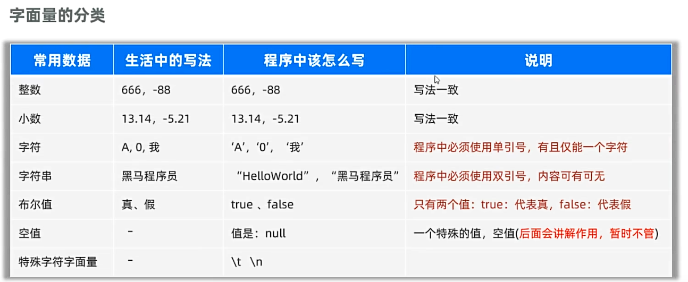
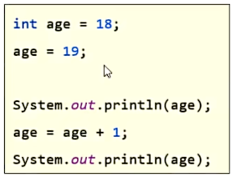
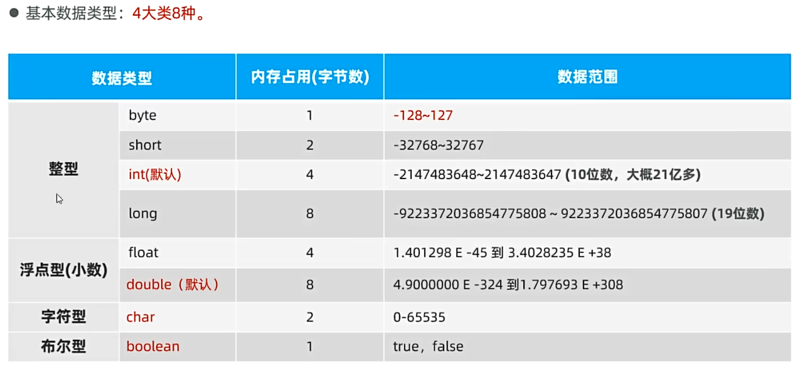
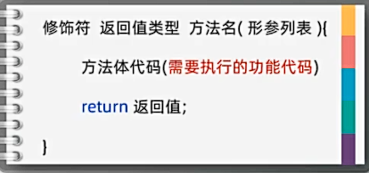
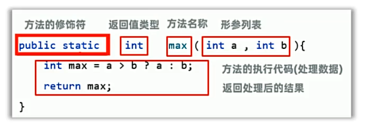

## 一、功能单元、方法、注释

### **1.功能单元：**

* 功能单元：功能单元的最小单位是方法。

### **2.注释：**

* 注释：在代码中添加注释，以方便阅读和理解代码。
* 注释类型：
  * 单行注释：使用//开头，表示单行注释。
  * 多行注释：使用/*...*/开头，表示多行注释。
  * 文档注释：使用/**...*/开头，表示文档注释，用在类、方法、属性......之上，会被提取到程序说明文档中。

## 二、字面量

### **字面量书写：**



* 其中，特殊字符字面量：
  * \t：制表符，表示一个制表符。
  * \n：换行符，表示一个换行符。
  * \r：回车符，表示一个回车符。
  * \b：退格符，表示一个退格符。
  * \f：换页符，表示一个换页符。

## 三、变量

### 1.变量：

* 变量：变量是程序中存储数据的内存单元，内存中的一块区域。可将变量理解为一个盒子，装程序需要处理的数据。
* 定义格式：
  **数据类型 变量名 = 数据;**
  例如：**int age = 18;**
  * 数据类型：盒子中数据的形式。
  * 变量名：变量的名称，由字母、数字、下划线组成，不能以数字开头。首字母建议小写，并且要有意义。
  * 赋值：将数据赋给变量。

### 为什么要定义变量记数据？

* 变量记录要处理的数据，编写代码灵活，方便后续使用管理。

### 2.变量的特点：

**（1）变量中的数据可被替换：**


* 其中，赋值是从右往左看

## 四、数据

### 1.存储数据的原理：

**(1)计算机中数据的最小单元：**

* 存储数据的最小单元：计算机中的数据都是以二进制的形式存储的。数据在计算机中的最小存储单元为：字节（byte，简称B）。一个字节占8个比特位（bit，简称b）。因此1B = 8bit。
  * 例如：6在计算机中为00000110。

**(2)字符在计算机中的存储原理：**

* 字符在计算机中的存储原理：字符在计算机中存储时，会按照ASCII码进行存储。ASCII码是一种字符编码标准，将字符映射为对应的数字。
  * 例如：A在计算机中为01000001。

### 2.数据类型：



* 注意事项：
  * 整数字面量默认为int，小数默认为double。若要定义为long，则需要使用L/l结尾；若要定义为float，则需要使用F/f结尾。

## 五、关键字和标识符：

### 1.关键字：

* 关键字：Java语言自己用的有特殊功能的词汇，不能作为标识符。
* 例如：public、class、int、if、else、for、while、static等

### 2.标识符：

* 标识符：Java语言中开发者自定义的名字。
* 取名规则：
  * 一般由字母、数字、下划线(_)和美元符($)组成。
  * 不能以数字开头，不能是关键字，不能包含特殊字符（例如&、%、#、@、!等）
  * 变量名：首字母建议小写，并且要有意义，满足”驼峰命名法“。（例如：int studentAge = 18;）
  * 类名：首字母大写，并且要有意义，满足”驼峰命名法“。(例如：HelloWorld、Student)

## 六、方法详解：

###　1.方法定义：

* 方法是指特定的任务或操作的代码块，代表一个功能。可以接收数据进行处理，返回处理后的结果。
* 方法定义格式：
  
  例如：
  

###  2.方法调用：
方法要被调用，才能被执行。
* 方法调用：调用方法时，需要使用方法名，并使用括号括起来。
  * 格式：方法名称(数据);

###  3.方法调用的其他形式：
**方法调用要考虑的两个问题：**
**（1）方法是否接收数据处理**
**（2）方法是否需要返回数据**
例如：
```java
//打印Hello World的方法，无参数、无返回值类型的方法
//如果方法无返回值结果，返回值类型需要声明为void，内部不能使用return语句
public static void print() {
    System.out.println("Hello World");
    System.out.println("Hello World");
    System.out.println("Hello World");
}
```
### 4.方法重载：
* 方法重载：同一个类中，出现多个方法名相同，参数列表不同，那么就称之为方法重载。
例如：
```java
public static void print(String str) {
    System.out.println(str);
}
public static void print(int a) {
    System.out.println(a);
}
public static void print(double a) {
    System.out.println(a);
}
public static void print(String str, int a) {
    System.out.println(str + a);
}
```
* 注意事项：方法重载时，只关心方法名称相同，参数列表（参数类型、参数个数、参数顺序）不同。
### 5.无返回值的方法可以直接通过单独的return语句结束方法的执行
例如：
```java
public static void div(int a, int b) {
     if (b == 0) {
      System.out.println("除数不能为0");
        return;//提前结束方法的执行，卫语言风格
     }
     System.out.println(a / b);
}
```
## 七、自动-强制类型转换：
### 1.自动类型转换：
* 自动类型转换：当一个变量的数据类型小于另一个变量的数据类型时，可以将小的数据类型直接赋值给大的数据类型。

例如：
```java
public static void main(String[] args) {
    byte a = 10;
    print(a);
    print2(a);
    print3(a);
}
public static void print(int b) {
    System.out.println(b);
}
public static void print2(long c) {
    System.out.println(c);
}
public static void print3(double d) {
    System.out.println(d);
}
```
* 注意事项：
表达式的最终结果类型由表达式的最高类型决定。
表达式中，byte/short/char是直接转换成int类型参与运算的。
### 2.强制类型转换：
* 强制类型转换：当一个变量的数据类型大于另一个变量的数据类型时，不可以将大的数据类型赋值给小的数据类型，需要进行强制转换。
例如：
```java
public static void main(String[] args) {
    int i = 10;
    //强制类型转换, 类型 变量2 = (类型) 变量1;
    byte j = (byte) i;
    print(j);
}
public static void print(byte j) {
    System.out.println(j);
}
```
将大的数据强制类型转换赋值给小的数据类型，会出现数据溢出。
浮点型强制转换成整型时，会丢失小数部分，保留整数部分。
## 八、输入输出：
### 1.输出：
* 输出：在Java中，输出数据到控制台的方式是使用System.out.println()方法。
### 2.输入：
* 输入：在Java中，输入数据到控制台的方式是使用Scanner类。
   * Scanner类：Scanner类是java.util包下的类，属于Java提供好的API，程序员可以直接调用。
   * API：Application Programming Interface，应用程序编程接口。
### 3.Scanner类使用，实现用户输入用户名：
```java
//1.导入Scanner类(自动导包)
public static void main(String[] args) {
    //2.创建Scanner类的对象
    Scanner sc = new Scanner(System.in);
    //3.获取用户输入
    System.out.println("请输入用户名：");
    //4.调用Scanner类的next()方法,其中next()方法的作用是让用户在输入数据并提交后，将用户提交的数据交给变量name，再继续执行程序。
    String name = sc.next();
    System.out.println("您输入的用户名是：" + name);
}
```


