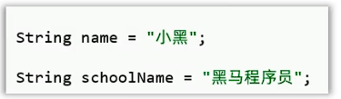
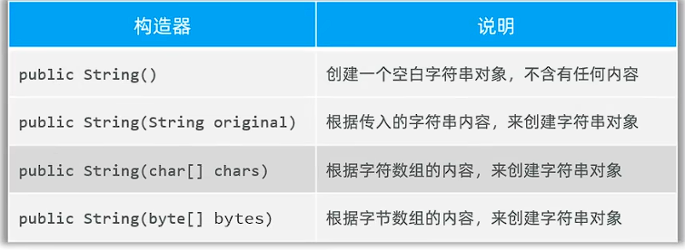
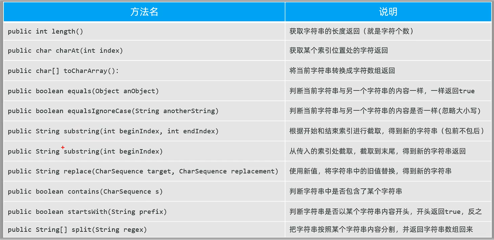
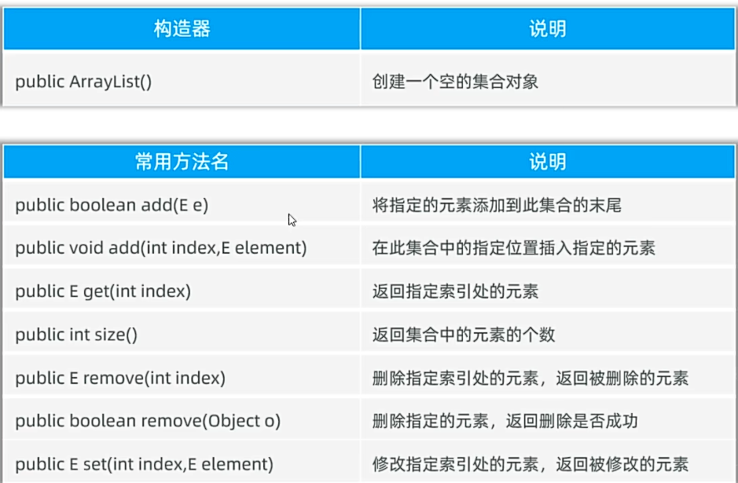

## 一、String
* Sting: 字符串, 它的对象可以封装字符串数据，并提供了很多方法完成对字符串的处理。
### 1. 创建字符串对象
* 方式一：Java中所有的字符串文字（“abc”）都为此类的对象
 
* 方式二：调用String类的构造器初始化字符串对象。
  
* 两种方式的区别：
  * 只要是以"..."的方式写的字符串对象，会存储到字符串常量池，且相同内容的字符串只储存一份；
  * 以new关键字创建的字符串对象，每new一次，都会创建一个对象，存储在堆中。
* String提供的常用方法：

例子：
```java
    public static void main(String[] args) {
        //认识创建字符串对象，封装要处理的字符串数据，用String的方法处理字符串
        // 1.方式一：直接使用""创建字符串对象，封装字符串数据
        String str1 = "HelloWorld";
        System.out.println(str1);
        System.out.println(str1.length());
        System.out.println("======================");
        // 2.方式二：使用new关键字创建字符串对象，封装字符串数据
        String str = new String();//不推荐
        System.out.println(str);//""空字符串
        System.out.println(str.length());
        String str2 = new String("HelloWorld");//不推荐
        System.out.println(str2);
        System.out.println(str2.length());
         System.out.println("======================");
        //只有""给出的字符串对象放在字符串常量池，相同内容只放一个
        String str3 = "HelloWorld";
        String str4 = "HelloWorld";
        System.out.println(str3 == str4);//true
        String str5 = new String("HelloWorld");
        String str6 = new String("HelloWorld");
        System.out.println(str5 == str6);//false
         //字符串比较应当使用equals方法，不要使用==，==默认比较两个字符的地址
        System.out.println(str5.equals(str6));
    }
}
```
### 2. 字符串的案例：生成验证码
```java
public class StringDemo2 {
    public static void main(String[] args) {
        //生成验证码
        System.out.println(getCode(4));
    }
   //生成验证码的方法
    public static String getCode(int n) {
        //1.生成随机数(要求包含大小写字母加数字)
        //定义一个字符串记住所有的字母数字，然后遍历，随机生成
        String str = "0123456789abcdefghijklmnopqrstuvwxyzABCDEFGHIJKLMNOPQRSTUVWXYZ";
        //用code字符串保存生成的验证码
        String code = "";
        //用for循环n次，每次生成一个随机字符
        for (int i = 0; i < n; i++) {
            //随机一个索引，用索引获取字符
            int index = (int)(Math.random() * str.length());
            //根据索引获取到的字符，拼接成字符串
            code += str.charAt(index);
        }
        return code;
    }
}
```
## 二、ArrayList
* ArrayList: 集合，是一种容器，用来装数据，类似于数组。
**有了数组，为什么还需要集合？**
* 数组一旦定义完成并启动后，长度就固定了
* 而集合的长度大小可变，功能丰富，开发用的更多。
* **学习目标：**
  * 1.创建ArrayList对象, 代表一个集合容器
  * 2.调用ArrayList的方法, 对容器中的数据进行增删改查操作
  
例子：
```java
public class ArrayListDemo {
    public static void main(String[] args) {
        //掌握ArrayList的使用
        //创建ArrayList对象
        ArrayList<String> list = new ArrayList<String>();//使用String限制集合中元素的类型
        list.add("张三");
        list.add("李四");
        list.add("王五");
        list.add("赵六");
        System.out.println(list);//打印所有数据
        System.out.println(list.get(0));//打印指定数据
        System.out.println(list.size());//打印集合长度
        //遍历集合
        for (int i = 0; i < list.size(); i++) {
            System.out.println(list.get(i));
        }
        //删除数据
        list.remove(0);//删除指定索引的数据
        System.out.println(list);
        list.remove("王五");//删除指定数据
        System.out.println(list);
        //改数据
        list.set(0,"张三");//将指定索引的数据改为指定数据
        System.out.println(list);
    }
}
```

