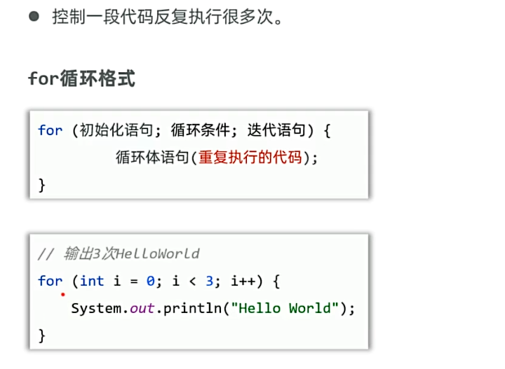
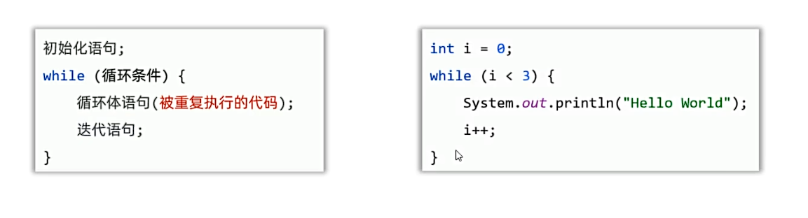
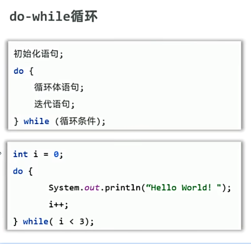
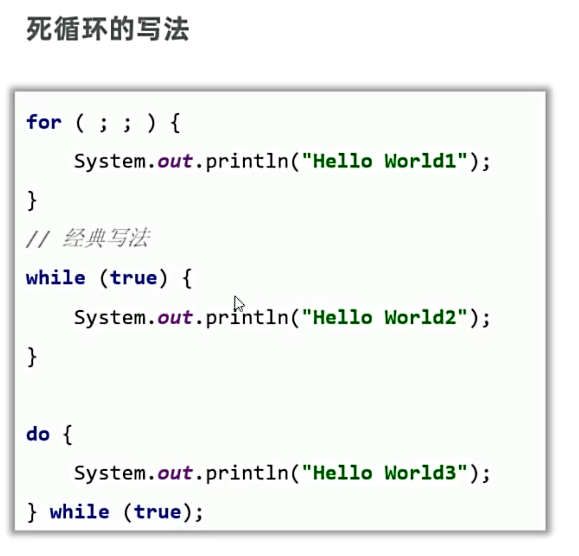
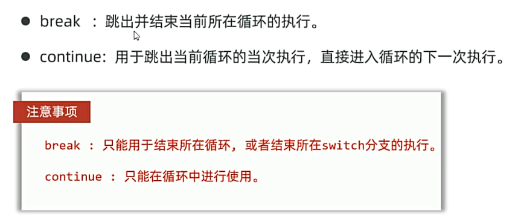
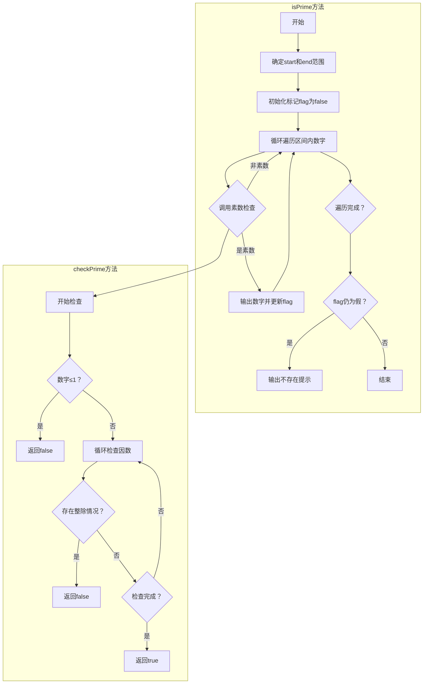

## 一、for循环
减少代码重复编写，提高代码效率，灵活控制程序运行。

* 上图的for循环过程：
  * 1.初始化条件：i=0
  * 2.判断条件：i<3，从零开始不断自增，直到i=3后，循环结束
  * 3.循环体：System.out.println("hello world");，i=3后结束，即将该循环体的代码执行3遍

## 二、while循环

* while循环过程和for循环过程相同
* 使用场景：当不知道循环的次数时，使用while循环；知道循环几次时，用for循环。
例如：
```java
//求1+2+3+...+n的整数和
    public static int forTest1(int n) {
        int sum = 0;
        for (int i = 1; i <= n; i++) {
            sum += i;
        }
        return sum;
    }
//纸张为0.1mm，折叠多少次可以达到珠穆朗玛峰的高度8848m
    public static int whileTest2() {
        int count = 0;
        double paper = 0.0001;
        double height = 8848;
        while (paper < height) {
            paper *= 2;
            count++;
        }
        return count;
    }
```
## 三、do-while循环

* do-while循环特点：do-while循环先执行，后循环，因此至少会执行一次循环体
* 三种循环的区别：
  * for循环和while循环先判断后执行，do-while循环先执行，后判断。
  * for循环中，控制循环变量只能在循环中使用，while循环和do-while循环中，控制循环变量可以在循环外使用

## 四、死循环
* 死循环：可以一直执行的一种循环，若不干预，程序会一直运行下去。


## 五、嵌套循环
循环中包含着循环。
例如：
```java
//打印四列五行星星
   public static void forTest1() {
        //打印五行
        for (int i = 1; i <= 5; i++) {
            //打印四列
            for (int j = 1; j <= 4; j++) {
                System.out.print("*");//不换行打印
            }
            System.out.println();//换行打印
        }
//定义方法,打印99乘法表
    public static void forTest2() {
        //编程先从行开始打印，因此先打印行
        //i=1~9
        for (int i = 1; i <= 9; i++) {
            //定义循环打印列
            //j=1~i
            for (int j = 1; j <= i; j++) {
                System.out.print(j + "x" + i + "=" + (i * j) + "\t");
            }
            System.out.println();
        }
    }
```
## 六、跳转关键字


## 七、经典案例
### 1.简单计算器
```java
public static void main(String[] args) {
        //完成一个简易的计算器
        //接收用户的输入
        Scanner sc = new Scanner(System.in);
        System.out.println("请输入第一个数字：");
        double num1 = sc.nextDouble();
        System.out.println("请输入第二个数字：");
        double num2 = sc.nextDouble();
        System.out.println("请输入运算符(+ - * /)：");
        String operator = sc.next();
        //调用方法
        double result = calculator(num1, num2, operator);
        //输出结果
        System.out.println("结果为：" + result);

    }
    //完成一个简易的计算器
    public static double calculator(double num1, double num2, String operator) {
        BigDecimal result = new BigDecimal("0");
        BigDecimal b1 = new BigDecimal(Double.toString(num1));
        BigDecimal b2 = new BigDecimal(Double.toString(num2));
        switch (operator) {
            case "+":
                result = b1.add(b2);
                break;
            case "-":
                result = b1.subtract(b2);
                break;
            case "*":
                result = b1.multiply(b2);
                break;
            case "/":
                result = b1.divide(b2, 2, RoundingMode.HALF_UP);
                break;
            default:
                System.out.println("输入有误，请重新输入！");
                break;
        }
        return result.doubleValue();
    }
```
### 2.猜数字小游戏
```java
private static void guessNumber() {
        //生成一个1-100之间的随机数
        //Math.random()生成一个[0,1)之间的随机数
        //Math.random() * 100生成一个[0,100)之间的随机数
        //(int) (Math.random() * 100) + 1生成一个[1,100]之间的随机数
        int number = (int) (Math.random() * 100) + 1;
        //第二种生成随机数的方法
        //Random random = new Random();
        //int number = random.nextInt(100) + 1;

        //接收用户输入的数字
        int count = 0;  // 新增计数器
        Scanner sc = new Scanner(System.in);
        ScheduledExecutorService scheduler = Executors.newScheduledThreadPool(1);
        AtomicBoolean inputFlag = new AtomicBoolean(false);
        System.out.println("呐~那边的杂鱼先生，我在1-100之间想了一个数字，你来猜一下吧！如果猜对了，我什么都会听你的哦~");
        while (true) {
            System.out.println("快点猜啊：");
            inputFlag.set(false);
            // 启动定时提醒任务
            ScheduledFuture<?> reminder = scheduler.scheduleAtFixedRate(() -> {
                if (!inputFlag.get()) {
                    System.out.println("杂鱼先生发什么呆呀~为什么不猜数字啊？难道你是害怕了吗，还真的是太逊了呢");
                }
            }, 5, 5, TimeUnit.SECONDS);
            int guessNumber = sc.nextInt();//接收用户输入的数字
            inputFlag.set(true);// 标记用户已经输入了数字
            reminder.cancel(true);// 取消定时提醒任务
            count++;  // 计数器加1
            //判断用户输入的数字是否正确
            if (guessNumber == number) {
                System.out.println("欸？ 呜啊~~~~~~~（大哭惊慌的逃离）");
                    break;
            }else if(count > 8){
                System.out.println("杂鱼先生真笨呢~正确答案是~" + number);
                break;
            }
            else if (guessNumber > number) {
                System.out.println("残念~~，猜的太大了，那边的杂鱼先生，请教教我是怎么猜的吧？");
                System.out.println("或啦~~，干吧内~~，干吧内~~");
            } else {
                System.out.println("スカ~~，猜的这么小，那边的小蛆虫先生，还要猜几次才能猜中啊，杂鱼~ 杂鱼~");
                System.out.println("或啦~~，干吧内~~，干吧内~~");
            }
        }
```
* 其中，关于Random生成随机数的方法：
  *技巧：减加法
```java
Random r = new Random();
int num = r.nextInt(10) + 1;//生成1-10的随机数 => 减小数，即1-1，10-1 => (0,9)+1
int num = r.nextInt(27) + 65;//生成65-91的随机数 => 减小数，即65-65，91-65 => (0,26)+65
```
### 3.生成验证码
```java
 //2.定义方法，生成验证码
    public static String getCode(int n) {
        //3.定义字符串变量code，用来保存生成的验证码
        String code ="";
        //4.定义for循环，循环n次，每次生成一个随机字符
        for (int i = 0; i < n; i++) {
            //5.随机生成包含数字和大小写字母的验证码
            int type = (int)(Math.random() * 3);//随机生成0,1,2，代表三种验证码（数字、大写字母、小写字母）
            switch (type) {
                case 0:
                    //随机生成0~9的数字
                    code += (int)(Math.random() * 10);
                    break;
                case 1:
                    //随机生成A~Z的大写字母
                    char ch = (char)(Math.random() * 26 + 65);
                    code += ch;
                    break;
                case 2:
                    //随机生成a~z的小写字母
                    char ch1 = (char)(Math.random() * 26 + 97);
                    code += ch1;
                    break;
            }

        }
        return code;
    }
```
### 4.接收输入的两个数，并判断两个数之间是否存在素数，有就输出具体的数字，没有就提示“不存在素数”
```java
 //接收输入的两个数，并判断两个数之间是否存在素数，有就输出具体的数字，没有就提示“不存在素数”
    public static void isPrime(int num1, int num2) {
        boolean flag = false;
        int start = Math.min(num1, num2);
        int end = Math.max(num1, num2);
        for (int i = start; i <= end; i++) {
            if (checkPrime(i)) {
                System.out.println(i);
                flag = true;
            }
        }
        if (!flag) {
            System.out.println(start + "和" + end + "之间不存在素数");
        }
    }
    //判断一个数是否为素数
    public static boolean checkPrime(int num) {
        if (num <= 1) {
            return false;
        }
        for (int i = 2; i <= Math.sqrt(num); i++) {//若 num 有因数，必存在一个因数 ≤ 其平方根。
            if (num % i == 0) {
                return false;
            }
        }
        return true;
    }
```
* 关于上述程序的流程图：

