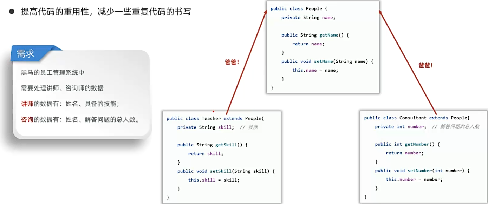
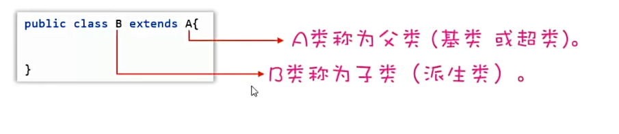
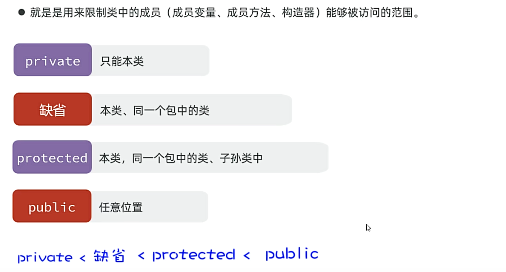
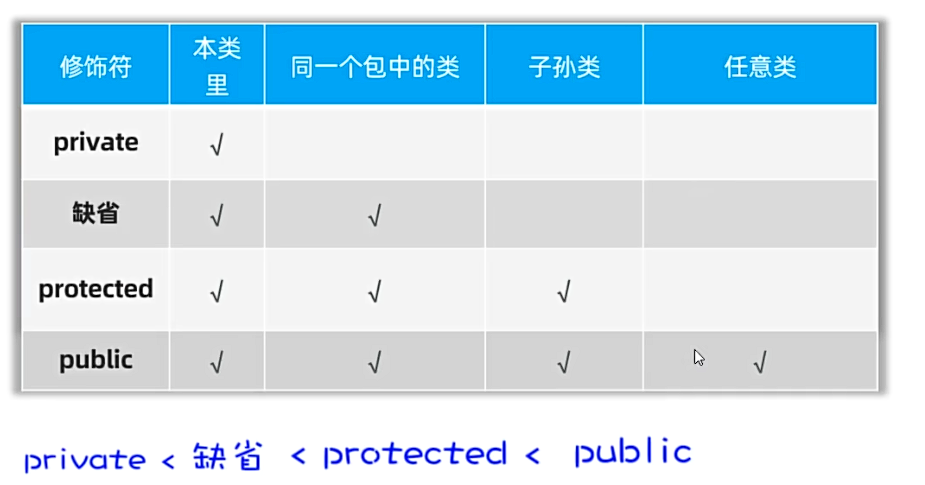
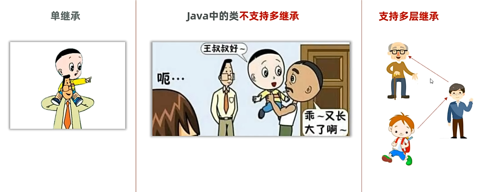
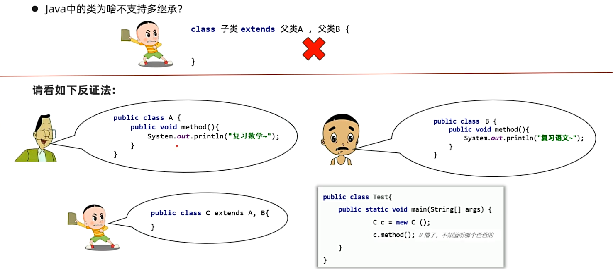
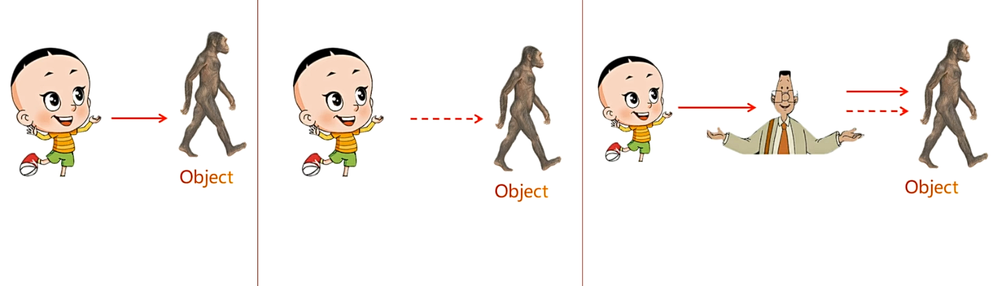
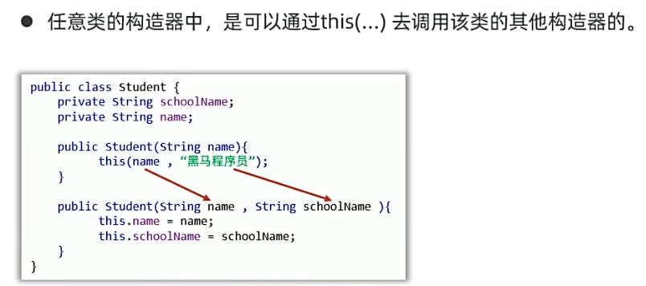

## 一、继承

* 使用extends关键字，可以在两个类之间建立父子关系，子类继承父类的属性和方法。
  
  **儿子在前，爸爸在后**
* 子类能继承什么？
  * 子类能继承父类的非私有成员变量和成员方法。
  * 继承后子类的对象是由父类和子类共同完成。
例子：
```java
/**
 * Test.java
 */
 public static void main(String[] args) {
        // 子类可以继承父类的非私有成员变量
        // 子类的对象是由子类和父类多张设计图共同创建的，因此子类对象是完整的
        Student student = new Student();
        student.setName("张三");
        student.setAge(18);
        student.setSex("男");
        student.setChinese(90);
        student.setMath(100);
        System.out.println(student.getName());
        System.out.println(student.getAge());
        System.out.println(student.getSex());
        System.out.println(student.getChinese());
        System.out.println(student.getMath());
    }
```
```java
// 父类
// 继承作用：减少代码复用，提高代码的扩展性
public class People {
    private String name;
    private int age;
    private String sex;

    public String getName() {
        return name;
    }

    public void setName(String name) {
        this.name = name;
    }

    public int getAge() {
        return age;
    }

    public void setAge(int age) {
        this.age = age;
    }

    public String getSex() {
        return sex;
    }

    public void setSex(String sex) {
        this.sex = sex;
    }
}
```
```java
// 子类
public class Student extends People {//儿子在前，父亲在后
    private double chinese;
    private double math;

    public double getChinese() {
        return chinese;
    }

    public void setChinese(double chinese) {
        this.chinese = chinese;
    }

    public double getMath() {
        return math;
    }

    public void setMath(double math) {
        this.math = math;
    }
}
```
## 二、权限修饰符


例如：
```java
/**
 * Father.java
 */
public class Father {
    // 1. private：只能在当前类中访问
    private void show() {
        System.out.println("父类中的show方法");
    }

    // 2. default：只能在当前类、同一个包的类中访问
    void show2() {
        System.out.println("父类中的show2方法");
    }

    // 3. protected：只能在当前类、同一个包的类、子类中访问
    protected void show3() {
        System.out.println("父类中的show3方法");
    }

    // 4. public：在任何类中访问
    public void show4() {
        System.out.println("父类中的show4方法");
    }

    public static void main(String[] args) {
        Father f = new Father();
        f.show();
        f.show2();
        f.show3();
        f.show4();//无报错，正常调用
    }
}
```
```java
/** 
 * Son.java
 */
public class Son extends Father {
    public void son() {
//       show();//报错，private修饰的方法只能在当前类中访问
//       show2();//报错，缺省的方法只能在当前类、同一个包的类中访问
       show3();
       show4();
    }
}
```
```java
/** 
 * Demo.java
 */
 public class Demo {
    public static void main(String[] args) {
        Father f = new Father();
//        f.show();//报错，private修饰的方法只能在当前类中访问
//        f.show2();//报错，缺省的方法只能在当前类、同一个包的类中访问
//        f.show3();//报错，protected修饰的方法只能在当前类、同一个包的类、子孙类中访问
        f.show4();
    }
}
```
## 三、继承的特点


* Java中的祖宗类：Object，要么默认继承Object，要么简洁继承Object。
* 因此Object类是所有类的祖宗类。
 
* 继承后子类访问成员的特点：就近原则
  * 即先在子类的局部范围找，然后在子类的成员范围内找，然后在父类成员范围内找，如果父类中还找不到则报错
例子：
```java
public class Test2 {
    // 了解继承就近原则的特点
    public static void main(String[] args) {
        Son son = new Son();
        son.show();
    }
//在同一个文件中嵌套在其他类内部需要加”static“修饰
    static class Father {
        String name = "FatherName";
        public void show1() {
            System.out.println("爸爸的方法");
        }
    }
//在同一个文件中嵌套在其他类内部需要加”static“修饰
    static class Son extends Father {
        String name = "SonName";

        public void show1() {
            System.out.println("儿子方法");
        }
        public void show() {
            String name = "showName";
            System.out.println(name);// 打印“showName”,就近原则要求现在方法内部找到name变量，若找不到，则继续往外找
            System.out.println(this.name);// 打印“SonName”,当局部变量与外成员变量重名时，this.name表示成员变量
            System.out.println(super.name);// 打印“FatherName”,若子成员变量和父类中的成员变量重名，则可以使用super.name表示父类成员变量
            show1();// 打印“儿子方法”,就近原则要求现在方法内部找到show1方法，若找不到，则继续往外找
            super.show1();// 打印“爸爸的方法”,若子成员方法与父类中的成员方法重名，则可以使用super.show1()表示父类成员方法
        }
    }
}
```
## 四、方法重写
* 当在子类中，父类中的某个方法不好用，或无法满足需求时，子类可重写一个方法名称、参数列表一样的方法，覆盖父类的方法，称为方法重写，也称为方法覆盖。
* 注意事项
  * 子类重写父类方法时，访问权限应当大于或等于父类方法。(public > protected > default > private) 
  * 重写的方法返回值类型，必须与被重写的方法的返回值一致，或者范围更小。
  * 私有方法、静态方法不能被重写，会报错。
例子：
```java
public class Test {
    public static void main(String[] args) {
        // 认识方法重写
        Cat cat = new Cat();
        cat.cry();
    }
}
//当一个类并没有嵌套在其他类中时，不需要加static修饰符
class Cat extends Animal{
    // 方法重写：方法名称、形参、修饰符都要和父类保持一致
    // 重写的规范：声明不变，重新实现
    @Override// Override注解，方法重写的校验注解，表示重写父类的方法，作用是在进行方法重写时，强行要求重写的方法和父类一致，否则报错
    public void cry(){
        System.out.println("喵喵喵");
    }
}

class Animal{
    public void cry(){
        System.out.println("Animal cry~~~");
    }
}
```
* 方法重写的应用场景：
例子：
```java
public class Test2 {
    public static void main(String[] args) {
        //方法重写的应用场景：子类重写Object的toString方法，返回对象内容；
        Student student = new Student( "张三", 18, "男" );
        System.out.println( student );
        //直接输出对象时，默认调用的是Object的toString方法，返回对象的地址
        //输出对象的地址无意义，所以重写toString方法，返回对象的内容

    }
}
class Student {
    private String name;
    private int age;
    private String sex;

    public Student() {

    }
    public Student(String name, int age, String sex) {
        this.name = name;
        this.age = age;
        this.sex = sex;
    }

    public String getName() {
        return name;
    }

    public void setName(String name) {
        this.name = name;
    }

    public int getAge() {
        return age;
    }

    public void setAge(int age) {
        this.age = age;
    }

    public String getSex() {
        return sex;
    }

    public void setSex(String sex) {
        this.sex = sex;
    }

    @Override
    public String toString() {
        return "Student{" +
                "name='" + name + '\'' +
                ", age=" + age +
                ", sex='" + sex + '\'' +
                '}';
    }
}
```
## 五、子类构造器
* 子类的全部构造器，都会先调用父类的构造器，再执行自己。
* 原因：默认情况下，子类全部构造器的第一行代码是super()（写不写都有），它会调用父类的无参构造器。
        如果父类没有无参构造器，则必须再子类构造器第一行手写super()，指定调用父类的有参构造器。
例子：
```java
/*
* Test.java
*/
public static void main(String[] args) {
        //子类构造器调用父类构造器的应用场景
        Teacher teacher = new Teacher( "李老师", 18, "男", "Java");
        System.out.println( teacher.getName());
        System.out.println( teacher.getAge());
        System.out.println( teacher.getSex());
        System.out.println( teacher.getSkill());

    }
```
```java
/*
* People.java
*/
// 父类
// 继承作用：减少代码复用，提高代码的扩展性
public class People {
    private String name;
    private int age;
    private String sex;
    public People() {
    }

    public People(String name, int age, String sex) {
        this.name = name;
        this.age = age;
        this.sex = sex;
    }

    public String getName() {
        return name;
    }

    public void setName(String name) {
        this.name = name;
    }

    public int getAge() {
        return age;
    }

    public void setAge(int age) {
        this.age = age;
    }

    public String getSex() {
        return sex;
    }

    public void setSex(String sex) {
        this.sex = sex;
    }
}
```
```java
/*
* Teacher.java
*/
public class Teacher extends People {
    private String skill;
    public Teacher() {

    }

    public Teacher(String name, int age, String sex, String skill) {
        //子类构造器调用父类构造器的应用场景
        //可以把子类继承自父类的数据也完成初始化赋值
        super( "李老师", 18, "男" );
        this.skill = skill;
    }

    public String getSkill() {
        return skill;
    }

    public void setSkill(String skill) {
        this.skill = skill;
    }
}
```
## 六、this()调用兄弟构造器

```java
/*
* Student.java
*/
public class Student {
    private String name;
    private int age;
    private String sex;
    private String school;

    public Student() {
    }

    @Override
    public String toString() {
        return "Student{" +
                "name='" + name + '\'' +
                ", age=" + age +
                ", sex='" + sex + '\'' +
                ", school='" + school + '\'' +
                '}';
    }
    //this调用兄弟构造器
    public Student(String name, int age, String sex) {
        //this() super()必须写在构造器第一行，且二者不能同时出现
        this(name, age, sex, "清华");
    }

    public Student(String name, int age, String sex, String school) {
        this.name = name;
        this.age = age;
        this.sex = sex;
        this.school = school;
    }

    public String getName() {
        return name;
    }

    public void setName(String name) {
        this.name = name;
    }

    public int getAge() {
        return age;
    }

    public void setAge(int age) {
        this.age = age;
    }

    public String getSex() {
        return sex;
    }

    public void setSex(String sex) {
        this.sex = sex;
    }

    public String getSchool() {
        return school;
    }

    public void setSchool(String school) {
        this.school = school;
    }
}
```
```java
/*
* Test3.java
*/
public class Test3 {
    //this调用兄弟构造器
    //创建对象，存储学生数据
    public static void main(String[] args) {
        Student student = new Student("张三", 18, "男");
        System.out.println(student);
        Student student2 = new Student("李四", 19, "男", "北大");
        System.out.println(student2);
    }
}
```

