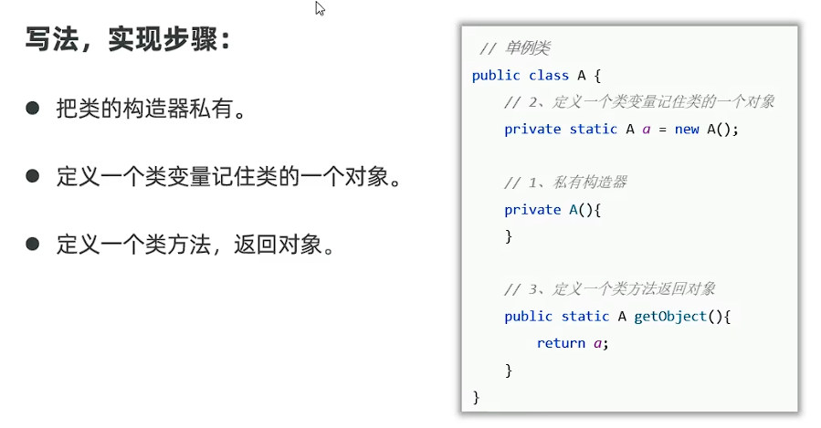
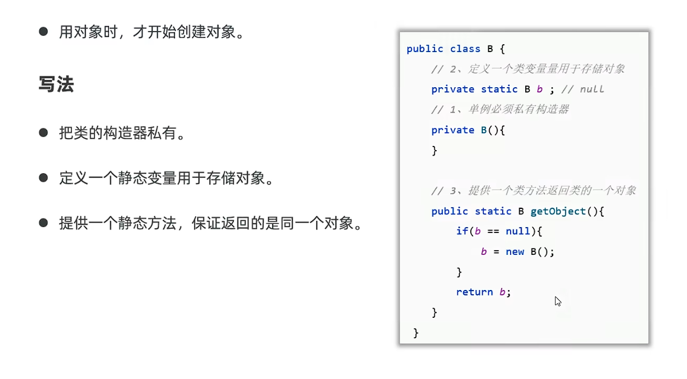
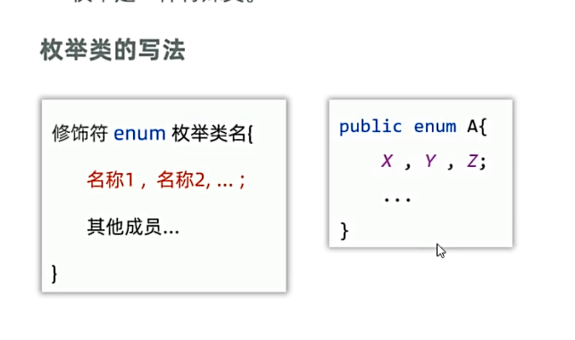
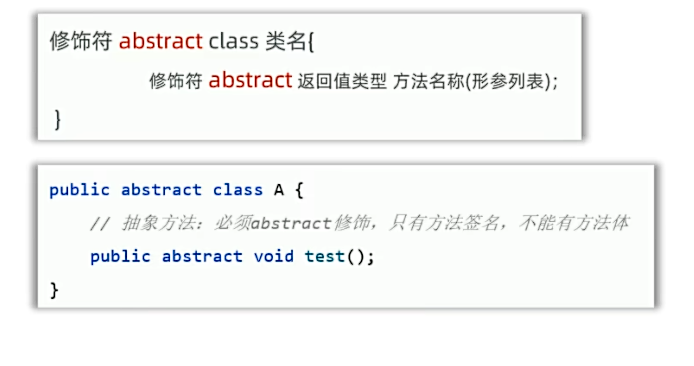
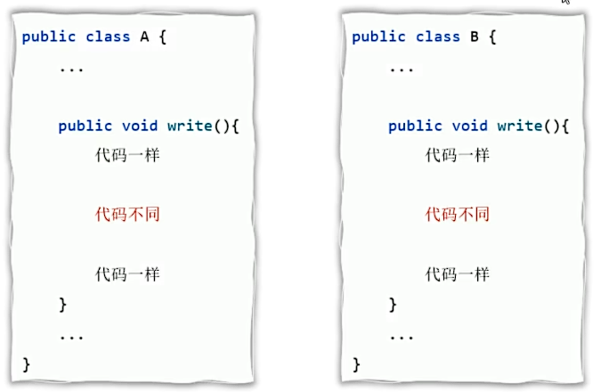
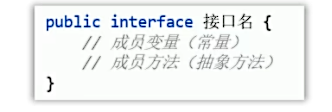
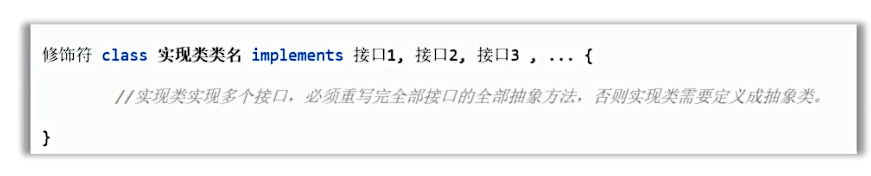
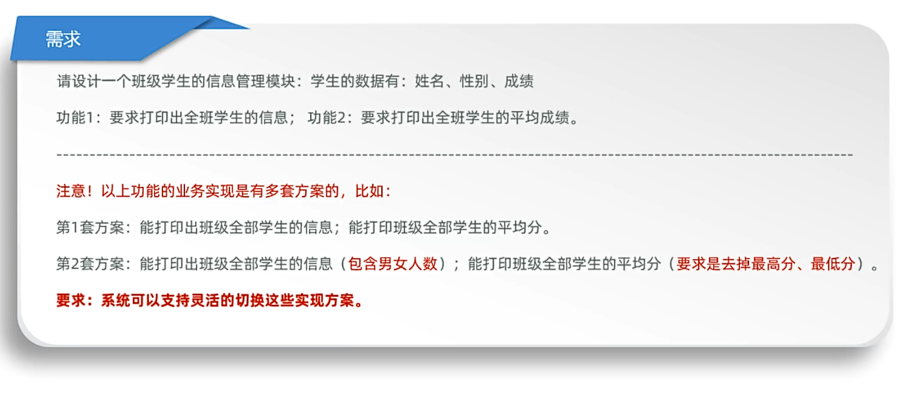
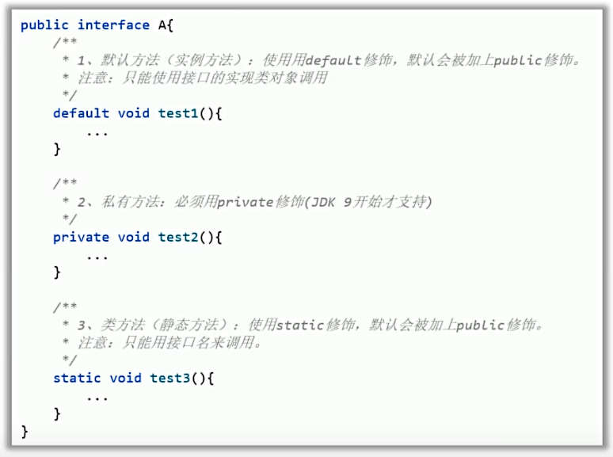
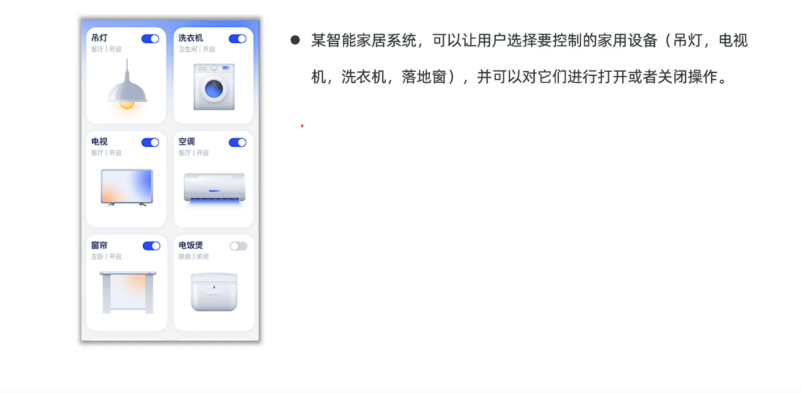

## 一、final关键字
final关键字：最终的意思，可以修饰：类、变量、方法。
* 修饰类：最终类，表示该类不能被继承。
* 修饰方法：最终方法，表示该方法不能被重写。
* 修饰变量：该变量有且只能被赋值一次。
**注意事项**：
* final修饰基本类型的变量，变量存储的数据不能被改变。
* final修饰引用类型的变量，变量存储的地址不能改变，但地址指向的对象的内容可以改变。
## 二、常量
* 常量：static final修饰的成员变量就是常量，并且值不能被改变。
* 作用：用于记录配置信息
* 命名规范：使用全大写字母，单词间用下划线隔开。
**常量的优势：**
* 代码可读性好，可维护性也更好
* 程序编译后，常量会被“宏替换”：出现常量的地方全部会被替换成其记住的字面量，这样可以保证使用常量和字面量的性能一样
例子：
```java
public class Test {
    //3.final修饰静态成员变量
    //final修饰的静态变量，这个变量为常量，可以记住一个固定值，且不能被修改
    //常量的书写规范：全部大写，多个单词之间用下划线链接
    public static final double PI = 3.14;
    //3.final修饰实例变量（无意义）
    public final int age = 10;
    public static void main(String[] args) {
        //认识Final关键字
        //3.final修饰的变量，有且仅能被赋值一次
        /*
        变量的种类：
        1.成员变量：成员变量，在类中声明，在类外初始化，在类外使用
                静态成员变量：static修饰的成员变量
                实例成员变量：非static修饰的成员变量
        2.局部变量：局部变量，在方法中声明，在方法中初始化，在方法中使用
         */
        final int num = 10;
        //num = 20;//报错，
        pay(10);

        final int[] array = {1, 2, 3};
        //array = new int[]{11,22,33};//报错，final修饰的数组，不能被重新赋值
        array[0] = 11;//但是，final修饰的数组中的元素，可以修改
    }
    public static void pay( final double a) {
        //a = 20;//3.报错，final修饰的变量，有且仅能被赋值一次
        System.out.println(a);
    }
}
//1.报错，因为final修饰的类不能被继承
final class A{
}
//class B extends A{
//}

//2.报错，final修饰的方法不能被修改
class C{
    public final void method(){
        System.out.println("C.method");
    }
}
class D extends C{
    //@Override
    //public void method(){
    //    System.out.println("D.method");
    //}
}
```
## 三、设计模式
* 设计模式：一个问题有很多种解法，其中最优的解法被总结出来，就称之为设计模式。
* 约有20多种设计模式，对应20中开发中遇到的问题。
**设计模式的核心学习思路:**
(1)该模式会解决什么问题？
(2)该模式怎么写？
### 1、单例设计模式
* 作用：确保某个类只创建一个对象。
* **单例的形式**
  *  饿汉式：拿取对象时候，对象已经创建好。
  *  懒汉式：拿取对象时候，才开始创建对象。
  **饿汉式单例**：
   
  例子：
  ```java
  //A.java
  public class A {
    //设计单例设计模式:饿汉式
    //2.创建一个静态的成员变量，用于保存本类的唯一对象
    //public static final A a = new A();//防止a的值被修改，使用final修饰符
    //或者私有化成员变量，
    private static A a = new A();


    // 1.构造方法私有化:确保单例类对外不创建太多对象
    private A() {
    }
    //当私有化成员变量后，创建一个静态方法，返回本类的唯一对象
    public static A getInstance() {
        return a;
    }
  }
```
```java
//Test.java
public class Test {
    public static void main(String[] args) {
      //设计单例类
        A a = A.getInstance();
        A b = A.getInstance();
        System.out.println(a == b);//true，说明a和b是同一个对象
    }
}
```
**懒汉式单例**：

例子：
```java
//B.java
public class B {
    //懒汉式单例
    // 2.私有化静态变量
    private static B b;
    //1.私有化构造信息
    private B() {
    }
    //3.提供公共的静态方法，返回实例，需要创建对象时才开始创建对象
    public static B getInstance() {
        if (b == null) {
            //第一次拿对象时，创建对象
            b = new B();
        }
        return b;
    }
}
```
```java
//Test.java
 public static void main(String[] args) {
      //设计单例类
        B b1 = B.getInstance();
        B b2 = B.getInstance();
        System.out.println(b1 == b2);//true，说明a和b是同一个对象
    }
```
## 四、枚举

* 特点：
  * 枚举类中第一行，只能写枚举的对象名称，且用逗号隔开
  * 这些名称，本质是常量，每个常量记住了枚举类的一个对象。
  * 枚举类都是最终类，不可被继承，枚举类都是继承java.lang.Enum类。
  * 枚举类的构造器都是私有的（写不写都是私有），因此，枚举类对外不创建对象。
**枚举类的应用场景：**
* 枚举类用于信息的分类和标志。
例子：
```java
//Constant.java
public class Constant {
    //用常量做信息分类和标识
    public static final int UP = 1;//上
    public static final int DOWN = 2;//下
    public static final int LEFT = 3;//左
    public static final int RIGHT = 4;//右
}
```
```java
//Direction.java
public enum Direction {
    // 定义枚举的元素，每个元素都是Direction类型的对象
    UP, DOWN, LEFT, RIGHT;
}
```
```java
//Test.java
public class Test2 {
    public static void main(String[] args) {
       // 枚举类的应用场景，信息的分类和标志
        // 需求：模拟上下左右移动
        //方案一：用常量做信息分类和标识: 缺点：参数值不受约束
        move( Constant.UP);
        //方案二：用枚举做信息分类和标识: 参数值会收到约束
        move2(Direction.RIGHT);
    }
    public static void move(int direction){
        switch (direction){
            case Constant.UP:
                System.out.println("向上移动");
                break;
            case Constant.DOWN:
                System.out.println("向下移动");
                break;
            case Constant.LEFT:
                System.out.println("向左移动");
                break;
            case Constant.RIGHT:
                System.out.println("向右移动");
                break;
            default:
                System.out.println("无效操作");
                break;
        }

    }
    public static void move2(Direction direction){
        switch (direction){
            case UP:
                System.out.println("向上移动");
                break;
            case DOWN:
                System.out.println("向下移动");
                break;
            case LEFT:
                System.out.println("向左移动");
                break;
            case RIGHT:
                System.out.println("向右移动");
                break;
            default:
                System.out.println("无效操作");
                break;
        }

    }
}
```
## 五、抽象类
* 抽象类：abstract，抽象，它可以修饰类、成员方法
* abstract修饰类，这个类就称之为抽象类。
* abstract修饰方法，这个方法就是抽象方法。
  
### 1.抽象类的注意事项、特点：
  * 抽象类中不一定有抽象方法，有抽象方法的类必须是抽象类。
  * 类有的成员、成员变量、方法、构造器，抽象类都可以有。
  * 抽象类的主要特点：**抽象类不能创建对象**，仅作为特殊的父类，让子类继承并实现。
    * 抽象类定义出来的目的就是被子类继承，就是为了生孩子。
  * 一个类继承抽象类，必须重写抽象类的全部抽象方法，否则这个类也必须要定义成抽象类。
### 2.抽象类的应用：
* 父类知道每个子类都要做某个行为，但每个子类要做的情况不一样，父类定义成抽象方法，交给子类重写实现。
  * 这样设计是为了更好地支持多态。
例子：
```java
//Animal.java
public abstract class Animal {
    //描述动物的叫声
    public abstract void shout();
}
```
```java
//Dog.java
public class Dog extends Animal{
    @Override
    public void shout() {
        System.out.println("汪汪汪");
    }
}
```
```java
//Cat.java
public class Cat extends Animal{
    @Override
    public void shout() {
        System.out.println("喵喵喵");
    }
}
```
```java
public class Test {
    public static void main(String[] args) {
      //认识抽象类的使用场景
        Animal animal = new Dog();
        animal.shout();
        animal = new Cat();
        animal.shout();
    }
}
```
### 3.模板方法设计模式：
* 模板方法设计模式：提供一个方法作为完成某类功能的模板，模板方法封装了每个实现步骤，但允许子类提供特定步骤的实现。
* 模板方法设计模式目的：提高代码复用性，简化子类设计。
  
* 写法：
  * 1.定义一个抽象类。
  * 2.在里面定义2个方法：
    * 一个是模板方法：把共同的步骤放进去
    * 另一个是抽象方法：把变化的步骤放进去，不确定的实现步骤，交给具体的子类来完成。
    * 其中，建议使用final关键字修饰模板方法
      * final方法是给子类直接使用，不能被子类重写。
      * 一旦子类重写了模板，模板方法就失效了。
例子：
```java
//Animal.java
  public abstract class Animal {
    //1.模板方法设计模式
    public void write() {
        System.out.println("狼和狗都是动物");
        System.out.println("狼和狗都吃肉");
        //2.模板方法知道子类要写信息，但子类的信息不同，父类定义一个抽象方法
        //具体写什么，由子类去实现
        shout();
    }
    public abstract void shout();
}
```
```java
//Wolf.java
public class Wolf extends Animal{
    @Override
    public void shout() {
        System.out.println("呜呜呜");
    }
}
```
```java
//Dog.java
public class Dog extends Animal{
    @Override
    public void shout() {
        System.out.println("汪汪汪");
    }
}
```
```java
//Test.java
public class Test {
    public static void main(String[] args) {
        // 理解抽象类的使用场景，模板方法设计模式
        // 写一个关于狼和狗的介绍
        //     第一段说狼和狗都是动物
        //     第二段说呜呜叫，狗汪汪叫
        //     第三段说狼和狗都是吃肉的
        Dog dog = new Dog();
        dog.write();
        System.out.println("------------------");
        Wolf wolf = new Wolf();
        wolf.write();
    }
}
```
## 六、接口
* 接口：interface，用于定义接口
 
* **接口不能创建对象！！！**
* 接口是被类来实现（implement）的，实现接口的类称为实现类，一个类可以实现多个接口。
 
```java
//B.java
public interface B {
    void play();
}
```
```java
//A.java
public interface A {
    // JDK8前，接口只能定义常量和抽象方法
    // 1.常量，接口中定义的常量默认是public static final修饰的
    //public static final int NUM = 10;
    int NUM2 = 20;
    // 2.抽象方法，接口中定义的方法默认是public abstract修饰的
    //public abstract void eat();
    void eat();
    void show();
}
```
```java
//Test.java
public class Test {
    // 认识接口，搞清楚接口的特点和使用
    public static void main(String[] args) {
        System.out.println(A.NUM2);
        C c = new C();
        c.eat();
        c.play();
        c.show();
    }

}
// C被成为实现类，同时实现多个接口。
// 实现类实现多个接口，必须重写完全部接口的全部抽象方法，否则这个类必须被定义成抽象类
class C implements A,B{
    @Override
    public void eat() {
        System.out.println("吃");
    }
    @Override
    public void show() {
        System.out.println("show");
    }
    @Override
    public void play() {
        System.out.println("play");
    }
}
```
* 使用接口的好处
  * 弥补单继承的不足，一个类可以实现多个接口，类的角色更多，功能更强大。
  *  让程序面向接口耦合，程序员可以方便的切换各种业务实现（更利于程序的解耦合）。
**接口的经典案例**

例子：
```java
//Test.java
public class Test {
    public static void main(String[] args) {
       // 完成算成绩小案例
        // 1.定义学生类，创建学生对象，封装。学生数据，才能交给别人处理
        // 2.准备学生数据
        Student[] students = new Student[10];
        students[0] = new Student("张三", 100, "男");
        students[1] = new Student("李四", 90, "男");
        students[2] = new Student("王五", 80, "男");
        students[3] = new Student("赵六", 70, "男");
        students[4] = new Student("钱七", 60, "男");
        students[5] = new Student("孙八", 50, "男");
        students[6] = new Student("周九", 40, "男");
        students[7] = new Student("吴九", 30, "男");
        students[8] = new Student("郑十", 20, "男");
        students[9] = new Student("王十一", 10, "男");
        // 3.提供两套方案，支持灵活切换（解耦合）：面向接口编程
        //  定义一个接口（规范思想）：必须完成打印全班学生信息，必须完成计算平均分
        // 定义一套实现类，实现接口：打印学生信息，实现打印平均成绩
        // 定义一套实现类，实现接口，打印学生信息（男女人数），实现打印平均成绩（去掉最高分，去掉最低分）
        //调用方法
        ClassDataInter classDataInter = new ClassDataInterImpl1(students);
        classDataInter.printAllStudentInfo();
        classDataInter.printAllStudentAverageScore();
        System.out.println("=================================");
        classDataInter = new ClassDataInterImpl2(students);
        classDataInter.printAllStudentInfo();
        classDataInter.printAllStudentAverageScore();
    }
}
```
```java
//Student.java
public class Student {
    private String name;
    private double score;
    private String sex;

    public Student() {
    }

    public Student(String name, double score, String sex) {
        this.name = name;
        this.score = score;
        this.sex = sex;
    }

    public String getName() {
        return name;
    }

    public void setName(String name) {
        this.name = name;
    }

    public double getScore() {
        return score;
    }

    public void setScore(double score) {
        this.score = score;
    }

    public String getSex() {
        return sex;
    }

    public void setSex(String sex) {
        this.sex = sex;
    }

    @Override
    public String toString() {
        return "Student{" +
                "name='" + name + '\'' +
                ", score=" + score +
                ", sex='" + sex + '\'' +
                '}';
    }
}
```
```java
//ClassDataInter.java
public interface ClassDataInter {
    //打印学生信息
    void printAllStudentInfo();
    //打印学生平均成绩
    void printAllStudentAverageScore();
}
```
```java
//ClassDataInterImpl1.java
public class ClassDataInterImpl1 implements ClassDataInter{
    private Student[] students;//记住全班的学生信息
    public ClassDataInterImpl1(Student[] students) {
        this.students = students;
    }

    @Override
    public void printAllStudentInfo() {
        //打印全班学生信息
        System.out.println("全班学生信息如下：");
        for (int i = 0; i < students.length; i++) {
            Student student = students[i];
            System.out.println("姓名："+student.getName());
            System.out.println("性别："+student.getSex());
            System.out.println("成绩："+student.getScore());
            System.out.println();
        }
    }

    @Override
    public void printAllStudentAverageScore() {
        //打印全班学生平均成绩
        double sum = 0;
        System.out.println("全班学生平均成绩为：");
        for (int i = 0; i < students.length; i++) {
            Student student = students[i];
            sum += student.getScore();
        }
        System.out.println(sum/students.length);
    }
}
```
```java
//ClassDataInterImpl2.java
public class ClassDataInterImpl2 implements ClassDataInter{
    private Student[] students;//记住全班的学生信息
    public ClassDataInterImpl2(Student[] students) {
        this.students = students;
    }
//    实现接口，打印学生信息（男女人数），实现打印平均成绩（去掉最高分，去掉最低分）
    @Override
    public void printAllStudentInfo() {
        System.out.println("全班学生信息为：");
        int num = 0;
        for (int i = 0; i < students.length; i++) {
            Student student = students[i];
            System.out.println("姓名："+student.getName());
            System.out.println("性别："+student.getSex());
            System.out.println("成绩："+student.getScore());
            System.out.println();
            if (student.getSex().equals("男")){
                num++;
            }
        }
        System.out.println("男学生人数为："+num);
        System.out.println("女学生人数为："+(students.length-num));
    }

    @Override
    public void printAllStudentAverageScore() {
        System.out.println("全班学生平均成绩为：");
        double sum = 0;
        double max = students[0].getScore();
        double min = students[0].getScore();
        for (int i = 0; i < students.length; i++) {
            Student student = students[i];
            if (student.getScore()>max){
                max = student.getScore();
            }
            if (student.getScore()<min){
                min = student.getScore();
            }
            sum += student.getScore();
        }
        System.out.println((sum - max - min) /(students.length-2));

    }
}
```
**JDK8后，接口新增的方法：**

* 新增这些方法的作用
  * 增强了接口的能力，便于项目的维护和扩展。 
```java
// A.java
public interface A {
    //1. 默认方法（普通实例方法）：加default关键字修饰
    //默认会使用public修饰
    //使用实现接口类的方法调用接口中的默认方法
    default void eat(){
        System.out.println("A eat");
        show();
    }
    //2.私有方法（JDK9后支持）
    //私有的实例方法，使用接口中的其他实例方法调用
    private void show(){
        System.out.println("A show");
    }
    //3. 静态方法
    //默认用public修饰
    //使用当前接口名来调用
    static void play(){
        System.out.println("A play");
    }
}
```
```java
// Test.java
public class Test {
    public static void main(String[] args) {
        // 了解JDK8后接口新增的三种方法，并理解
        A a = new AImpl();
        a.eat();
        A.play();
    }
}
//使用实现接口类的方法调用接口中的默认方法
class AImpl implements A {
}
```
* **接口注意事项：**
  * 1.接口与接口可以多继承，一个接口可以同时继承多个接口[重点] 
  * 2.一个接口可以继承多个接口，如果多个接口中存在方法签名冲突，此时不支持多继承，不支持多实现
  * 3.一个类继承了父类，又同时实现了接口，如果父类中和接口中有同名默认方法，实现类会优先使用父类
  * 4.一个类实现了多个接口，如果多个接口中存在同名的默认方法，可以不冲突，这个类重写该方法即可
```java
public class Test {
    // 理解接口的几条注意事项
// 3.一个类继承了父类，又同时实现了接口，如果父类中和接口中有同名默认方法，实现类会优先使用父类
    public static void main(String[] args) {
        Dog dog = new Dog();
        dog.show();//使用的是父类Animal的show方法
        dog.go();//此时使用的是接口A2的show方法
    }
}
// 1.接口与接口可以多继承，一个接口可以同时继承多个接口[重点]
// 类与类：单继承，一个类只能继承一个父类
// 类与接口：多继承，一个类可以同时实现多个接口
// 接口与接口：多继承，一个接口可以同时继承多个接口
interface A {
    void eat();
}
interface B {
    void show();
}
interface C extends A,B {
    void play();
}
class D implements C {
    @Override
    public void play() {
    }
    @Override
    public void eat() {
    }
    @Override
    public void show() {
    }
}
// 2.一个接口可以继承多个接口，如果多个接口中存在方法签名冲突，此时不支持多继承，不支持多实现
interface A1{
    void eat1();
}
interface B1{
    // String eat1();//签名冲突,报错
    void eat1();
}
interface C1 extends A1,B1{

}
// 3.一个类继承了父类，又同时实现了接口，如果父类中和接口中有同名默认方法，实现类会优先使用父类
interface A2{
    default void show(){
        System.out.println("A2 show");
    }
}
class Animal{
    public void show(){
        System.out.println("Animal show");
    }
}
class Dog extends Animal implements A2{
    //若要强行使用A2接口的方法，则需要在写一个方法来中转
    public void go(){
        A2.super.show();
    }
}
// 4.一个类实现了多个接口，如果多个接口中存在同名的默认方法，可以不冲突，这个类重写该方法即可
interface A3{
    default void show(){
        System.out.println("A3 show");
    }
}
interface B3{
    default void show(){
        System.out.println("B3 show");
    }
}
class C3 implements A3,B3{
    @Override
    public void show() {
        A3.super.show();//若不重写方法，则报错，若需要使用接口的方法，则需要重写方法，并在方法中使用super关键字
        B3.super.show();
    }
}
```
* **接口和抽象类的区别：**
* 相同点：
  * 1.多是抽象形式，都有抽象方法，都不能创建对象。
  * 2.都是派生子类的形式：抽象类被子类继承使用，接口是被实现类实现。
  * 3.继承抽象类或实现接口，都必须重写完他们的抽象方法，否则自己成为抽象类或报错。
  * 4.都支持多态，都实现了解耦合。
* 不同点：
  * 1.抽象类中可以定义全部的普通成员，接口只能定义常量，抽象方法（JDK8后新增的三种方式）。
  * 2.抽象类只能被单类继承，接口可以被类多实现
  * 3.一个类继承抽象类就不能再继承其他类，一个类实现了接口（还可以继承其他类或者实现其他接口）。
  * 4.抽象类体现模板思想：更利于父类，实现代码复用性。
  * 5.接口更适合做功能的解耦合，使耦合性更强，更灵活。
## 七、最终案例

**实现举例：**
```java
// JD.java
public class JD {
    //定义家电
    private String name;
    //状态：开关
    private boolean status;//默认是关的

    public void press() {
        status = !status;
    }

    public JD() {
    }


    public JD(String name, boolean status) {
        this.name = name;
        this.status = status;
    }

    @Override
    public String toString() {
        return "JD{" +
                "name='" + name + '\'' +
                ", status=" + status +
                '}';
    }

    public boolean isStatus() {
        return status;
    }

    public void setStatus(boolean status) {
        this.status = status;
    }

    public String getName() {
        return name;
    }

    public void setName(String name) {
        this.name = name;
    }

}
```
```java
//各种家电类
//lamp.java
public class Lamp extends JD{
    //灯
    public Lamp(String name, boolean status) {
        super(name, status);
    }
}
//tv.java
public class TV extends JD{
    public TV(String name, boolean status) {
        super(name, status);
    }
}
//Air.java
public class Air extends JD{
    public Air(String name, boolean status) {
        super(name, status);
    }
}
//WashMachine.java
public class WashMachine extends JD {
    //洗衣机
    public WashMachine(String name, boolean status) {
        super(name, status);
    }
}
```
```java
//接口，以及控制器类
//Status.java
public interface Status {
    // 定义一个方法，模拟开关
    void press();
}
//Control.java
public class Control {
    //控制系统可将其设置成单例类
    private static Control control = new Control();
    private Control(){}
    public static Control getControl() {
        return control;
    }
    public static void printAllStatus(JD[] jds) {
        for (int i=0 ; i < jds.length ; i++){
            JD jd = jds[i];
            System.out.println((i + 1) + "." + jd.getName() + "开关状态：" + (jd.isStatus()? "开" : "关"));
        }
    }

    public void press(JD jd) {
        System.out.println(jd.getName() + "开关状态：" + (jd.isStatus()? "开" : "关"));
        System.out.println("开始操作：");
        jd.press();
        System.out.println(jd.getName() + "目前开关状态：" + (jd.isStatus()? "开" : "关"));
    }
}
```
```java
//Test.java
public class Test {
    public static void main(String[] args) {
        //目标：面向对象实现家居控制系统
        //角色：设备（吊灯、电视机、洗衣机......）
        //具备功能：开、关
        //控制系统，控制设备的开和关
        //1.定义设备类,代表家里的设备
        //2.准备设备对象，放到数组中，代表家电设备
        JD[] jds = new JD[4];
        jds[0] = new TV("电视机",true);
        jds[1] = new WashMachine("洗衣机",false);
        jds[2] = new Lamp("吊灯",false);
        jds[3] = new Air("空调",true);
        //3.接口控制设备开关
        //4.创建控制开关的类，控制设备开关
        Control control = Control.getControl();
        //5.控制电视机
        //control.press(jds[0]);
        //6.控制台操作 a.展示全部设备当前的情况，b.让用户选择操作
        //打印所有色被开关的现状
        while (true) {
            Control.printAllStatus(jds);
            //7.让用户选择操作
            System.out.println("请选择要控制的设备:");
            Scanner scanner = new Scanner(System.in);
            int index = scanner.nextInt();
            switch (index) {
                case 1:
                    control.press(jds[0]);
                    break;
                case 2:
                    control.press(jds[1]);
                    break;
                case 3:
                    control.press(jds[2]);
                    break;
                case 4:
                    control.press(jds[3]);
                    break;
                case 0:
                    System.out.println("退出");
                    return;
                default:
                    System.out.println("输入错误");
                    break;
            }
        }
    }
}
```


  

