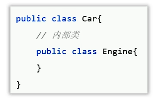
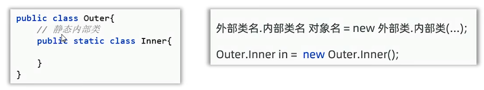
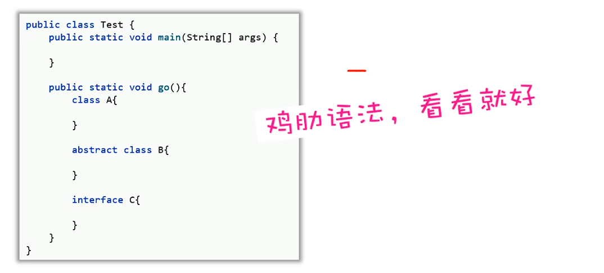
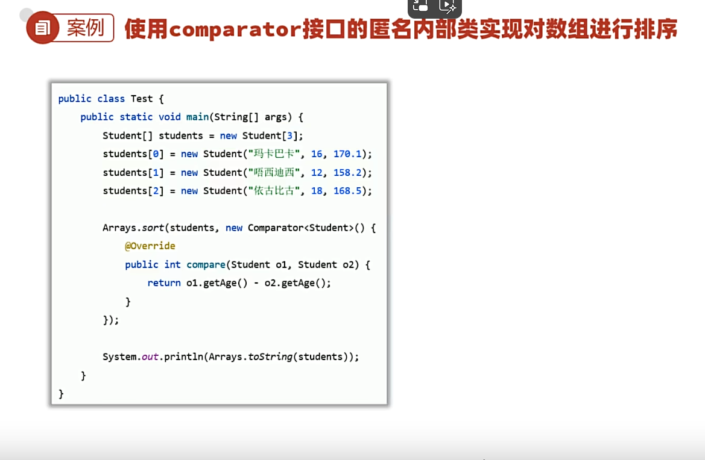

## 一、代码块
* 代码块是类的五个成分之一（成员变量、构造器、方法、代码块、内部类）
**代码块有两种：**
* 静态代码块：
  * 格式：static {} 
  * 特点：类加载时自动执行，类只会加载一次，因此静态代码块也只执行一次
  * 作用：完成类的初始化。例如：对静态变量的初始化赋值。
```java
public class Demo {
    public static String name;
    public static void main(String[] args) {
        // 搞清楚代码块的基本作用
        System.out.println("main方法代码块");
    }
    // 静态代码块，由static修饰，属于类，与类一起优先加载，自动执行一次
    static {
        System.out.println("静态代码块");
        name = "张三";//完成对静态资源的初始化，适用于初始化数组，静态成员变量
    }
}
```
* 实例代码块：
  * 格式：{}
  * 特点：每次创建对象时，执行实例代码块，并在构造器前执行
  * 作用：和构造器一样，用于完成对象的初始化。例如：对实例变量的初始化赋值。
例子：
```java
 //实例代码块：无static修饰，属于对象，每次创建对象优先执行
public class Demo2 {
    //实例代码块：无static修饰，属于对象，每次创建对象优先执行
    {
        System.out.println("实例代码块");
    }
    public static void main(String[] args) {
        System.out.println("main方法代码块");//若无对象，实例代码块不执行
        new Demo2();
        new Demo2();
        new Demo2();//new几次对象，实例代码块紧跟着执行几次
    }
}
```
## 二、内部类
* 如果一个类定义在另一个类的内部，则该类称为内部类
* 场景：当一个类的内部，包含了一个完整的事物，且这个事物没有必要再单独设计时，则可以将该事物设计为内部类。
  
* 种类：
  * 成员内部类：就是类的一个普通成员，类似于成员变量、成员方法
成员内部类举例：
```java
//  外部类
public class Outer {

    public static String name = "Outer";
    private int age = 10;
    public void show2() {
        System.out.println("show2()");
    }
    public static void show1() {
        System.out.println("show1()");
    }
    //  成员内部类: 无static修饰，属于外部类的对象持有
    public class Inner {
        private String name2;
        public void show() {
            System.out.println("show()");
            System.out.println(name);//成员内部类可以访问外部类的静态成员
            show1();
            System.out.println(age);//也可以访问外部类的实例成员
            show2();
            System.out.println(name2);
        }
        public String getName2() {
            return name2;
        }

        public void setName2(String name2) {
            this.name2 = name2;
        }
    }
}
```
```java
// 测试类
public class InnerClassDemo1 {
    public static void main(String[] args) {
       //认识内部类
        //成员内部类创建对象的格式：
        // 外部类名称.内部类名称 对象名 = new 外部类名称.new 内部类名称();
        Outer.Inner inner = new Outer().new Inner();
        inner.setName2("张三");
        inner.show();
        //成员内部类访问外部类成员的特点:
        //1.成员内部类可以访问外部类的静态成员, 也可以访问外部类的实例成员
        //2.成员内部类的实例方法中，可以直接拿到当前寄生的外部类对象：外部类名称.this
        System.out.println("================================");
        People.Heart heart = new People().new Heart();
        heart.beat();
    }

}
class People{
    private int HeartBeat = 100;
    public class Heart{
        private int heartRate = 60;
        public void beat(){
            int heartRate = 80;
            //输出80
            System.out.println(heartRate);
            //输出60
            System.out.println(this.heartRate);
            //输出100
            System.out.println(People.this.HeartBeat);
        }
    }
}
```
  * 静态内部类: 有static修饰，属于外部类自己持有
  
静态内部类的例子：
```java
// 外部类
public class Outer {
    public static String name = "Outer";
    public void show1() {
        System.out.println("show1()");
    }
    // 静态内部类：属于外部类本身持有
    public static class Inner {
        public void show() {
            System.out.println("show()");
            System.out.println(name);//静态内部中可以直接方位外部类的静态成员
            //show1();//报错，静态内部类不能访问外部类的实例成员
        }
    }
}
```
```java
public class InnerClassDemo2 {
    public static void main(String[] args) {
        //理解静态内部类的使用
        //静态内部类创建对象的格式：
        // 外部类名称.内部类名称 静态对象名 = new 外部类名称.内部类名称();
        Outer.Inner inner = new Outer.Inner();
        inner.show();
        //1. 静态内部中可以直接方位外部类的静态成员
        //2. 静态内部类不能够直接访问外部类的实例成员
    }
}
```
  * 局部内部类: 定义在方法中、代码块中、构造器执行体中。**屁用没有**
  
  * **匿名内部类（重点）**
    * 是一种特殊的局部内部类；
    * 匿名：指的是程序员不需要为这个类声明名字，默认有个隐藏的名字。
    * 特点：匿名内部类本质就是一个子类，并会立即创建一个子类对象。
    * 作用：更方便地创造子类对象。
  
  匿名内部类例子：
```java
//Animal.java
public abstract class Animal {
    public abstract void eat();
}
//Test.java
public class Test {
    public static void main(String[] args) {
        // 认识匿名内部类
        //匿名内部类有名字：外部类$编号.class
        //匿名内部类本质上是一个子类，同时会立即构建一个子类对象
        Animal animal = new Animal() {
            @Override
            public void eat() {
                System.out.println("猫吃鱼");
            }
        };
        animal.eat();
    }
}
```
**匿名内部类在开发中的常见形式：**
* 通常作为一个对象参数传输给方法。
例子：
```java
public class Test2 {
    public static void main(String[] args) {
        // 内部类的使用形式：可以作为对象参数传输给方法使用。
        // 老师和学生都参加游泳比赛
        Swim s = new Swim() {
            @Override
            public void swim() {
                System.out.println("学生参加游泳比赛");
            }
        };
        joinSwim(s);
        System.out.println("==============================");
        joinSwim(new Swim() {
            @Override
            public void swim() {
                System.out.println("老师参加游泳比赛");
            }
        });//可以不创建对象，直接创建匿名内部类写进方法中。老师游泳和学生游泳等效
    }
    //设计方法，让老师与学生都参加游泳比赛
    public static void joinSwim(Swim s) {
        System.out.println("开始");
        s.swim();
        System.out.println("结束");
    }
}
interface Swim {
    void swim();
}
```
* **匿名内部类的真实使用场景**
  * 调用别人提供的方法实现需求时，这个方法刚好可以让我们传输一个匿名内部类对象给其使用。
例子：
```java
public class Test3 {

    public static void main(String[] args) {
        // 内部类的使用场景
        // 需求：创建一个登录窗口，窗口上写一个登录按钮
        JFrame win = new JFrame("登录窗口");
        win.setSize(300, 300);
        win.setLocationRelativeTo(null);
        win.setDefaultCloseOperation(JFrame.EXIT_ON_CLOSE);

        JPanel panel = new JPanel();
        win.add(panel);

        JButton btn = new JButton("登录");
        panel.add(btn);
        //java要求需要给按钮添加一个监听器对象，监听点击事件，这样可以对用户的操作做出反应
//        btn.addActionListener(new LoginListener());//使用自定义的LoginListener监听器类处理按钮点击的逻辑
        //方法二：使用匿名内部类实现ActionListener接口
        //开发中我们不需要主动去写匿名内部类，而是在使用别人的功能时，别人可以让我们写一个匿名内部类时，我们才写。
        btn.addActionListener(new ActionListener() {
            @Override
            public void actionPerformed(ActionEvent e) {
                System.out.println("用户点击了登录按钮");
            }
        });
        win.setVisible(true);
    }
}
//方法一：创建一个监听器实现类，实现监听器接口
class LoginListener implements ActionListener {
    @Override
    public void actionPerformed(ActionEvent e) {
        System.out.println("用户点击了登录按钮");
    }
}
```
* **匿名内部类另一个使用场景**
  
例子：
```java
//Student.java
public class Student {
    // 学生姓名 年龄 身高 性别
    private String name;
    private int age;
    private double height;
    private String sex;

    public Student() {
    }

    public Student(String name, int age, double height, String sex) {
        this.name = name;
        this.age = age;
        this.height = height;
        this.sex = sex;
    }

    public String getName() {
        return name;
    }

    public void setName(String name) {
        this.name = name;
    }

    public int getAge() {
        return age;
    }

    public void setAge(int age) {
        this.age = age;
    }

    public double getHeight() {
        return height;
    }

    public void setHeight(double height) {
        this.height = height;
    }

    public String getSex() {
        return sex;
    }

    public void setSex(String sex) {
        this.sex = sex;
    }

    @Override
    public String toString() {
        return "Student{" +
                "name='" + name + '\'' +
                ", age=" + age +
                ", height=" + height +
                ", sex='" + sex + '\'' +
                '}';
    }
}
```
```java
public class Test4 {
    public static void main(String[] args) {
        // 完成数组的排序，理解匿名内部类的用法。
        // 准备一个学生类型数组，存放6个学生对象
        Student[] students = new Student[6];
        students[0] = new Student("张三", 20, 1.75, "男");
        students[1] = new Student("李四", 19, 1.68, "女");
        students[2] = new Student("王五", 18, 1.69, "男");
        students[3] = new Student("赵六", 17, 1.70, "女");
        students[4] = new Student("孙七", 16, 1.71, "男");
        students[5] = new Student("周八", 15, 1.72, "女");

        //使用sun公司写好的API直接对数组进行排序
        //public static void sort(T[] a, Comparator<T> c)
        //说明： 参数一：需要排序的数组
        //      参数二：需要给sort声明一个Comparator比较器对象（用于制定排序规则）
        //sort方法会调用匿名内部类的compare方法，对数组的学生对象进行两两比较，实现排序
        Arrays.sort(students, new Comparator<Student>() {
            @Override
            public int compare(Student o1, Student o2) {
                //指定排序规则：
                // 如果认为左边对象 大于 右边对象，那么返回正整数
                //如果认为左边对象 小于 右边对象，那么返回负整数
                // 如果认为左边对象 等于 右边对象，那么返回0
//                if (o1.getAge() > o2.getAge()){
//                    return 1;
//                } else if (o1.getAge() < o2.getAge()) {
//                    return -1;
//                }
//                return 0;
                //下面代码可以等效于上面的if分支
                return o1.getAge() - o2.getAge();//按照年龄升序
                //return o2.getAge() - o1.getAge();//按照年龄降序
            }
        });
        //遍历学生对象输出
        for (int i = 0; i < students.length; i++) {
            Student student = students[i];
            System.out.println(student);
        }
    }
}
```
 
